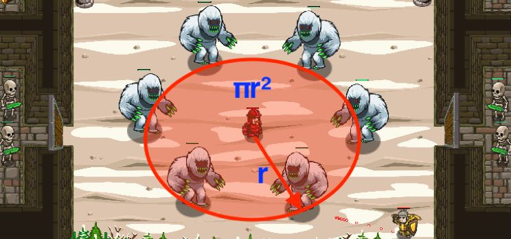

## _Area of Yetis_

#### _Legend says:_
> The best weapon against yetis is the Yetiborn!

#### _Goals:_
+ _Defeat the Yetis_

#### _Topics:_
+ **Variables**
+ **While Loops**
+ **While Loops with Conditionals**
+ **Array Indexes**
+ **Geometry**
+ **Accessing Properties**

#### _Solutions:_
+ **[JavaScript](areaOfYetis.js)**
+ **[Python](area_of_yetis.py)**

#### _Rewards:_
+ 387 xp
+ 178 gems

#### _Victory words:_
+ _THE BLOOD OF YETI FLOWS THROUGH HIS VEINS!_

___

### _HINTS_



It was a bad idea to encircle the chosen One. He can use the Ancient Shout.

Be careful, the power of the shout should be equal the area of the circle.

In geometry, the area enclosed by a circle of radius `r` is `π*r*r`. Here the Greek letter `π` represents a constant, approximately equal to `3.14159`, which is equal to the ratio of the circumference of any circle to its diameter.

```javascript
var area = Math.PI * radius * radius;
```

___
