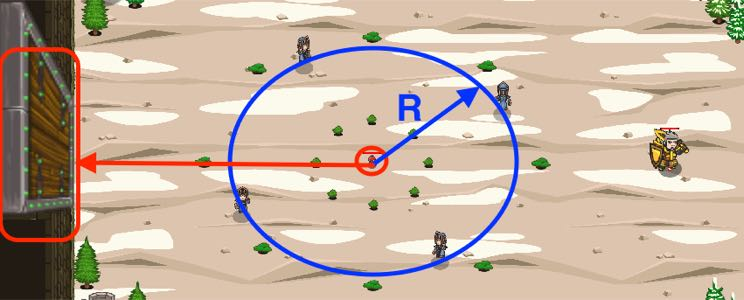

## _Danger Picklock_

#### _Legend says:_
> For this lockpick, the complexity of the lock doesn't matter.

#### _Goals:_
+ _Break the door_

#### _Topics:_
+ **Strings**
+ **Variables**
+ **While Loops**
+ **Return Statements**
+ **Geometry**
+ **Accessing Properties**

#### _Solutions:_
+ **[JavaScript](dangerPicklock.js)**
+ **[Python](danger_picklock.py)**

#### _Rewards:_
+ 387 xp
+ 178 gems

#### _Victory words:_
+ _THIS LOCKPICK IS A BIT LOUDER THAN TRADITIONAL METHODS._

___

### _HINTS_



We must break that Door. It's really tough, but we have a bomb.

First, we need to charge the bomb until the optimal value (it's written on the bomb).

Use the predefined function `almostEqual` to compare area values.

___

The area of a circle can be calculated with this formula:

```
area = radius * radius * PI
```

where `PI` is a mathematical constant, the ratio of a circle's circumference to its diameter, commonly approximated as 3.14159.

Also, don't forget to use `almostEqual` function to compare values in this level, because it's not a good idea to compare float numbers the direct way (`==`).

___
