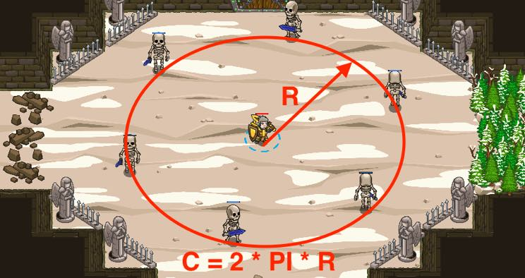

## _Bone Dance_

#### _Legend says:_
> You better keep up their song.

#### _Goals:_
+ _Your hero must survive_

#### _Topics:_
+ **Strings**
+ **Variables**
+ **While Loops**
+ **Return Statements**
+ **Geometry**
+ **Accessing Properties**

#### _Solutions:_
+ **[JavaScript](boneDance.js)**
+ **[Python](bone_dance.py)**

#### _Rewards:_
+ 387 xp
+ 178 gems

#### _Victory words:_
+ _DEM BONES, THEY WILL RISE AGAIN!_

___

### _HINTS_



Your goal is simple -- don't die.

Keep up the skeleton song and they will be peaceful.

Wait until the circumference of the skeleton circle is equal **`100`** and `say` anything.

___

You have already learnt what you need to complete this level. If you have problems, then go back to the previous levels and refresh your knowledge.

Don't forget to use `almostEqual` function to compare numbers. It can help to avoid a problem with the comparison of float numbers.

Also if you forgot, then the formula of the circumference of the circle is:

```
C = 2 * PI * R
where R is the radius
PI is approximately 3.14
```

___
