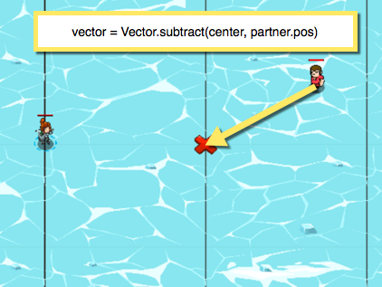
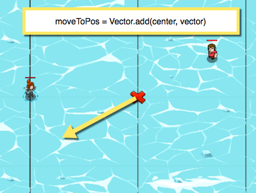

## _Circle Walking_

#### _Legend says:_
> Use Vector to mirror your partner's movements.

#### _Goals:_
+ _Mirror your ally's movement around the X_

#### _Topics:_
+ **Strings**
+ **Variables**
+ **While Loops**
+ **Array Indexes**
+ **Accessing Properties**
+ **Vectors**

#### _Solutions:_
+ **[JavaScript](circleWalking.js)**
+ **[Python](circle_walking.py)**

#### _Rewards:_
+ 1215 xp
+ 391 gems

#### _Victory words:_
+ _YOU'VE LEARNED A NEW WAY TO MOVE_

___

### _HINTS_

_Kelvintaph Glacier has many short level arcs covering different topics._

You should be familiar with unit position objects, like `hero.pos`. We've used them to specify fixed points in the 2D space using `pos.x` and `pos.y`.

Vectors can be used to represent fixed points in the world, and in fact `hero.pos` is a vector.

Vectors can also be used to represent information **relative** to points in the world, such as the **distance** (or magnitude) and **direction** from one point to another.

In this level, you first need to use `Vector.subtract(center, partner.pos)` to get a vector that represents the distance and direction from your partner to the center X:

Then you take the vector you got from that, and use it to find the point your hero needs to move to, relative to the center X with `Vector.add(center, vector)`:

The result, `moveToPos` is also a vector, which we will use as a fixed point with `move` to move the hero to the correct spot!

___
