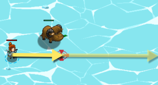
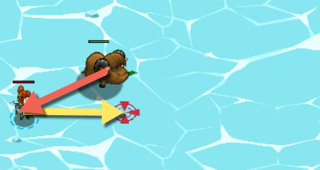
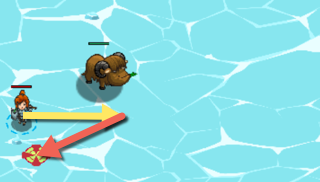

## _Skating Away_

#### _Legend says:_
> Weave your way through the yaks using vectors.

#### _Goals:_
+ _Move to the Red X_
+ _Don't anger any yaks_

#### _Topics:_
+ **Variables**
+ **While Loops**
+ **If Statements**
+ **Boolean Greater/Less**
+ **Vectors**
+ **Algorithm Average**

#### _Solutions:_
+ **[JavaScript](skating_away.js)**
+ **[Python](skating_away.py)**

#### _Rewards:_
+ 1244 xp
+ 398 gems

#### _Victory words:_
+ _WHAT'S OUR VECTOR, VICTOR?_

___

### _HINTS_

A Vector can represent the direction and distance between two points. Sometimes you'll want to keep the direction of a vector, but change it's distance.

The sample code gets the Vector from your hero to the end goal (the Red X), then makes it **1 meter** long with `Vector.normalize(goal)`. Then it uses `Vector.multiply(goal, 10)` to make it **10 meters**.

So far so good, but this will take your hero right past a yak!

So now, you need to use `Vector.subtract`, `Vector.normalize`, and `Vector.multiply` to get a 10m vector from the Yak to the hero:

Then add the vector from the yak to you, to the original vector to the goal:

That will give you a final moveToPos that takes you toward the goal, but also away from the yak!

___
