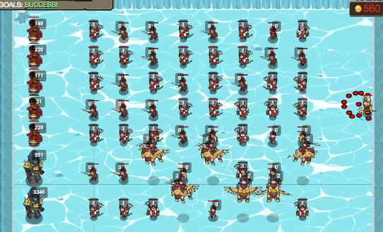

## _Binary Deployment_

#### _Legend says:_
> Devise an algorithm to convert decimal numbers to binary numbers and deploy the right squadrons of soldiers and archers.

#### _Goals:_
+ _Deploy 5 lines of troops_
+ _Bonus: Deploy 2 advanced lines of troops_

#### _Topics:_
+ **Strings**
+ **Variables**
+ **Return Statements**
+ **Accessing Properties**
+ **Assigning Properties**
+ **Vectors**

#### _Solutions:_
+ **[JavaScript](binaryDeployment.js)**
+ **[Python](binary_deployment.py)**

#### _Rewards:_
+ 1063-1571 xp
+ 317-473 gems

#### _Victory words:_
+ _01011001 01100101 01100001 01101000 00100001. DEPLOYED ADVANCED TRINARY TROOP LINES._

___

### _HINTS_

_There are only 10 types of people in the world: those who understand binary, and those who don't._

Your trusty paladins have been given specific deployments of soldiers and archers.  You are to summon and array them as instructed.

Unfortunately, the deployments are in the form of numbers that need to be converted to binary. You can access these numbers as paladin.deployment property. Soldiers are 0s, archers are 1s.

Each paladin will be in charge of 8 units, so be sure to include soldiers at the front of the line if the number is too low.  All units should form a perfect line to the right of the paladin.

The bonus goal is to deploy a trinary row to the warlocks.  In this case the digit 2 is represented by griffin riders.



___

We are used to numbers written in decimal, base 10.  Binary numbers are written in base 2.  This means that they only use the digits 0 and 1.  Counting looks like:

```
    1
   10
   11
  100
  101
  110
  111
 1000
 1001
 1010
 1011
 1100
 1101
 1110
 1111
10000
```

The values of the digits are 1, 2, 4, 8, 16, etc.

When converting a decimal number to binary, you will need to look for the highest power of 2 that is less than (or equal to) your number, place a 1 in that spot and subtract it from the number.  Repeat this process unitl you have finished the number.

Example:

```
107 = 64 + 32 + 8 + 2 + 1 = 1101011
```

For this level you will need 8 digits, so we add a 0 at the front to get 01101011.

This means that the given paladin will need soldier, archer, archer, soldier, archer, soldier, archer, archer.

___
