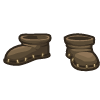
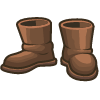
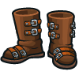
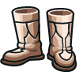
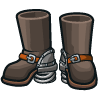
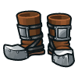
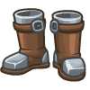
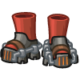
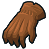

## Boots and Gloves

___


**Table of Contents:**
+ [Boots](#boots)
    * [Simple Boots](#simple-boots)
    * [Leather Boots](#leather-boots)
    * [Reinforced Boots](#reinforced-boots)
    * [Softened Leather Boots](#softened-leather-boots)
    * [Compound Boots](#compound-boots)
    * [Defensive Boots](#defensive-boots)
    * [Fine Boots](#fine-boots)
    * [Boots of Jumping](#boots-of-jumping)
    * [Boots of Leaping](#boots-of-leaping)
+ [Gloves](#gloves)
    * [Worker's Gloves](#worker-s-gloves)
    * [Emperor's Gloves](#emperor-s-gloves)

___

### Boots

___

#### _SIMPLE BOOTS_

Allows your `hero` to move using simple Up, Right, Down, and Left commands.



##### _`hero.moveDown(steps)`_ method

Moves the `hero` down (south) a bit.

**Example:**

```javascript
hero.moveDown();
```

**Optional Parameter:**
+ `steps`: `number` (ex. `2`)

##### _`hero.moveLeft(steps)`_ method

Moves the `hero` left (west) a bit.

**Example:**

```javascript
hero.moveLeft();
```

**Optional Parameter:**
+ `steps`: `number` (ex. `2`)

##### _`hero.moveRight(steps)`_ method

Moves the `hero` right (east) a bit.

**Example:**

```javascript
hero.moveRight();
```

**Optional Parameter:**
+ `steps`: `number` (ex. `2`)

##### _`hero.moveUp(steps)`_ method

Moves the `hero` up (north) a bit.

**Example:**

```javascript
hero.moveUp(2);
```

**Optional Parameter:**
+ `steps`: `number` (ex. `2`)

___

#### _LEATHER BOOTS_

Upgrades your `hero`'s movement to `moveXY`, which takes two coordinates arguments.



+ Speed: `+2m/s`

##### _`hero.moveXY(x, y)`_ method

The `moveXY` method sets the `hero`'s `targetPos` to the given (`x`, `y`) coordinates and also sets the `hero`'s `action` to `move` and moves until reaching the destination.

**Example:**

```javascript
hero.moveXY(24, 35);
```

**Required Parameters:**
+ `x`: `number` (ex. `24`)
+ `y`: `number` (ex. `35`)

___

#### _REINFORCED BOOTS_

Gives your `hero` the `moveXY` method and a few extra health points.



+ Speed: `+2m/s`
+ Health: `+8`

+ `hero.moveXY(x, y)`

___

#### _SOFTENED LEATHER BOOTS_

Slightly faster than leather boots, and way more stylish.



+ Speed: `+2.5m/s`

+ `hero.moveXY(x, y)`

___

#### _COMPOUND BOOTS_

Grants your hero the `move` method instead of `moveXY`.



+ Speed: `+2m/s`

+ `hero.moveXY(x, y)`


##### _`hero.maxSpeed`_ property

How fast the `hero` can move, in meters per second.

##### _`hero.move(position)`_ method

The `move` method sets the `hero`'s `targetPos` to the given (`x`, `y`) coordinates and also sets the `hero`'s `action` to `move` for one "step".

**Example:**

```javascript
hero.move({x: 24, y: 35});
```

**Required Parameters:**
+ `position`: `object` (ex. `{x: 24, y: 36}`)

___

#### _DEFENSIVE BOOTS_

Adds a lot of health, but slows you down by 2 meters per second.



+ Speed: `-2m/s`
+ Health: `+125`

+ `hero.maxSpeed`
+ `hero.move(position)`
+ `hero.moveXY(x, y)`

___

#### _FINE BOOTS_

Gives your hero the `move` and `dash` abilities.



+ Speed: `+2m/s`

+ `hero.maxSpeed`
+ `hero.move(position)`
+ `hero.moveXY(x, y)`

##### _`hero.dash(position)`_ method

The `dash` ability allows combatants to move quickly towards any `target` or `position`.

___

#### _BOOTS OF JUMPING_

Grants the `move` and `jumpTo` methods. Great for more advanced levels.



+ Speed: `+1.5m/s`

+ `hero.maxSpeed`
+ `hero.move(position)`
+ `hero.moveXY(x, y)`

##### _`hero.jumpTo(position)`_ method

Jump toward the given `target` unit or `position`.

**Example:**

```javascript
hero.jumpTo({x: 24, y: 35});
```

**Required Parameters:**
+ `position`: `object` (ex. `{x: 24, y: 36}`)

___

#### _BOOTS OF LEAPING_

Allows you to jump further and faster than with the Boots of Jumping.


+ Speed: `+2m/s`

+ `hero.jumpTo(position)`
+ `hero.maxSpeed`
+ `hero.move(position)`
+ `hero.moveXY(x, y)`

___


### Gloves

___

#### _WORKER'S GLOVES_

They're not comfortable, but they'll get the job done.



+ Health: `+5`

___

#### _EMPEROR'S GLOVES_

Spray chain lightning from your fingertips with these velvet gloves stitched with raw electricity.


+ Health: `+5`

+ `hero.canCast()`
+ `hero.cast()`

##### _`hero.cast("chain-lightning", target)`_ method

Casts a `"chain-lightning"` spell on `target`. Causes `120` damage to target and `75%` splash damage to other enemies if within `20m`.

**Stats:**
+ Name: `"chain-lightning"`
+ Time: `0.75s`
+ Damage: `120`
+ Radius: `20m`
+ Cooldown: `20s`

**Example:**

```javascript
hero.cast("chain-lightning", hero.findNearestEnemy());
```

**Reruired Parameters:**
+ `target`: `object` (ex. `hero.findNearestEnemy()`). _The target on which to cast "chain-lightning"_

___
