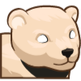

## _Companions_

___


**Table of Contents:**

* [Raven](#raven)
* [Wolf Pup](#wolf-pup)
* [Cougar](#cougar)
* [Brown Rat](#brown-rat)
* [Baby Griffin](#baby-griffin)
* [Mimik](#mimic)
* [Polar Bear Cub](#polar-bear-cub)
* [Blue Fox](#blue-fox)
* [Pugicorn](#pugicorn)

___

### _RAVEN_

Every hero needs a companion! This raven has been ravin' about joining you! The raven can fly, so low obstacles are not a problem for it.


#### _`pet`_ object

Gain control of your loyal `pet`! It will follow you around until you give it an order.

#### _`pet.fetch(item)`_ method

The `pet` takes and brings to the owner some items (like potions).

**Example:**

```javascript
var item = hero.findNearestItem();
if (item.type == "potion") {
    pet.fetch(item);
}
```

**Required Parameters:**
+ `item`: `object` (ex. `hero.findNearestItem()`) - _The item to fetch_

#### _`pet.findNearestByType(type)`_ method

Return the nearest of all units or items with the given `type` that the pet can see, even non-combatants.

**Example:**

```javascript
var potion = pet.findNearestByType("potion");
pet.fetch(potion);
```

**Required Parameters:**
+ `type`: `string` (ex. `"potion"`) - _The type of item to find_

**Returns:**
+ `object`: The nearest unit or item

#### _`pet.moveXY(x, y)`_ method

The `moveXY` method sets the pet's `targetPos` to the given (`x`, `y`) coordinates and also sets the pet's `action` to `move` and moves until reaching the destination.

**Example:**

```javascript
pet.moveXY(24, 35);
```

**Required Parameters:**
+ `x`: `number` (ex. `24`)
+ `y`: `number` (ex. `35`)

#### _`pet.on(eventType, eventHandler)`_ method

The method assigns an event handler (a `function`) for `eventType`.

**Possible `eventType`s:**
+ `"spawn"`: when the pet appears;
+ `"hear"`: when the pet hears something;

**Required Parameters:**
+ `eventType`: `string` (ex. `"spawn"`) - _The type of the event_
+ `eventHandler`: `function` (ex. `onSpawn`) - _The event handler (function) which runs on the event_

#### _`pet.say(message)`_ method

Makes the pet say the given `message`.

**Required Parameters:**
+ `message`: `string` (ex. `"Hi!"`)

___

### _WOLF PUP_

Every hero needs a companion! This wolf pup will loyally stand by your side!


+ `pet`
+ `pet.fetch(item)`
+ `pet.findNearestByType(type)`
+ `pet.moveXY(x, y)`
+ `pet.on(eventType, eventHandler)`
+ `pet.say(message)`

#### _`pet.catch(arrow)`_ method

The pet is trying to `catch` the `arrow` (can't catch shells like bullets). If you haven't commanded the pet, then it catches near arrows itself.

**Required Parameters:**
+ `arrow`: `object` (ex. `hero.findEnemyMissiles()[0]`) - _The arrow to catch_

#### _`pet.trick()`_ method

The pet can make some trick. Just for fun.

___

### _COUGAR_

Every hero needs a companion! This cougar will stand-by your hero's side against any challenge!


+ `pet`
+ `pet.fetch(item)`
+ `pet.findNearestByType(type)`
+ `pet.moveXY(x, y)`
+ `pet.on(eventType, eventHandler)`
+ `pet.say(message)`
+ `pet.trick()`

#### _`pet.chase(enemy)`_ method

The pet chases a weak `enemy`. The enemy forgets about anything and trying to flee only. The pet can chase only enemies whose `maxHealth < hero.maxHealth / 10`.

**Example:**

```javascript
var ogre = hero.findNearestEnemy();
if (ogre && ogre.maxHealth < hero.maxHealth / 10) {
    pet.chase(ogre);
}
```

**Required Parameters:**
+ `enemy`: `object` (ex. `hero.findNearestEnemy()`) - _The unit to chase_

___

### _BROWN RAT_

The sneaky brown rat is a perfect companion for the unscrupulous types.


+ `pet`
+ `pet.fetch(item)`
+ `pet.findNearestByType(type)`
+ `pet.moveXY(x, y)`
+ `pet.on(eventType, eventHandler)`
+ `pet.say(message)`
+ `pet.trick()`

#### _`pet.distractionNoise()`_ method

The pet makes noise and distracts close enemies for few seconds.

**Example:**

```javascript
if (pet.isReady("distraction-noise")) {
    pet.distractionNoise();
}
```

#### _`pet.isReady("ability")`_ method

Returns whether the given `ability` is ready to be used by the pet again.

**Example:**

```javascript
if (pet.isReady("chase")) {
    hero.chase(enemy);
}
```

**Required Parameters:**
+ `ability`: `string` (ex. `"chase"`) - _The ability for which to check readiness_

**Returns:**
+ `boolean`

___

### _BABY GRIFFIN_

Every hero needs a companion! This tiny griffin will assist your hero in their quest.


+ `pet`
+ `pet.fetch(item)`
+ `pet.findNearestByType(type)`
+ `pet.isReady("ability")`
+ `pet.moveXY(x, y)`
+ `pet.on(eventType, eventHandler)`
+ `pet.say(message)`
+ `pet.trick()`

#### _`pet.carryUnit(target, x, y)`_ method

The pet takes `target` and carries it to the point (`x`, `y`). The pet can carry only units whose `maxHealth < hero.maxHealth / 10`.

___

### _MIMIC_

Every hero needs a companion! This mimic will help you collect coins!


+ `pet`
+ `pet.fetch(item)`
+ `pet.findNearestByType(type)`
+ `pet.isReady("ability")`
+ `pet.moveXY(x, y)`
+ `pet.on(eventType, eventHandler)`
+ `pet.say(message)`
+ `pet.trick()`

___

### _POLAR BEAR CUB_

Every hero needs a companion! This young polar bear will follow you on your quest.



+ `pet`
+ `pet.fetch(item)`
+ `pet.findNearestByType(type)`
+ `pet.isReady("ability")`
+ `pet.moveXY(x, y)`
+ `pet.on(eventType, eventHandler)`
+ `pet.say(message)`
+ `pet.trick()`

#### _`pet.coldBlast()`_ method

The pet freezes enemies around itself for few seconds.

___

### _BLUE FOX_

The quick, blue fox jumps over the buried treasure.


+ `pet`
+ `pet.fetch(item)`
+ `pet.findNearestByType(type)`
+ `pet.isReady("ability")`
+ `pet.moveXY(x, y)`
+ `pet.on(eventType, eventHandler)`
+ `pet.say(message)`
+ `pet.trick()`

#### _`pet.shapeShift()`_ method

The pet transform itself to the decoy -- the fleeing peasants. No enemy in the `30m` range can't stand to hit this easy target.

___

### _PUGICORN_

No one knows the origins of the mysterious, majestic, pugicorn (we think Pender had something to do with it).


+ `pet`
+ `pet.fetch(item)`
+ `pet.findNearestByType(type)`
+ `pet.isReady("ability")`
+ `pet.moveXY(x, y)`
+ `pet.on(eventType, eventHandler)`
+ `pet.say(message)`
+ `pet.trick()`

#### _`pet.charm(enemy)`_ method

The pet charms an enemy `whose maxHealth < hero.maxHealth / 5` and the enemy protects the pet some time.

___
