## _Weapon - Ranger_

___


**Table of Contents:**

* [Crude Crossbow](#crude-crossbow)
* [Large Bolt Crossbow](#large-bolt-crossbow)
* [Oak Crossbow](#oak-crossbow)
* [Hunting Rifle](#hunting-rifle)
* [Simple Rifle](#simple-rifle)
* [Boomrod](#boomrod)
* [Bolt Spitter](#bolt-spitter)
* [Boltsaw](#boltsaw)
* [Lightning Stick](#lightning-stick)
* [Ron Defender](#ron-defender)
* [Deadeye Crossbow](#deadeye-crossbow)
* [Reinforced Crossbow](#reinforced-crossbow)
* [Rapidfire Rifle](#rapidfire-rifle)
* [Precision Rifle](#precision-rifle)
* [Gift of the Trees](#gift-of-the-trees)

___

### _CRUDE CROSSBOW_

Modest range and damage; it's the beginner crossbow. But hey, it's cheap!

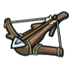

+ Damage: `8.5`
+ Damage per second: `17.0`
+ Range: `30m`

#### _`hero.attack(target)`_ method

The `attack` method makes the hero attack the `target` unit.

**Example:**

```javascript
// Attack an enemy named "Treg" twice.
hero.attack("Treg");
hero.attack("Treg");

// Attack the nearest enemy once, using a variable.
var enemy = hero.findNearestEnemy();
hero.attack(enemy);
```

**Required Parameters:**

+ `target`: `object` (ex. `hero.findNearestEnemy()`) - _The target enemy to attack_

#### _`hero.attackRange`_ property

How far the hero's attack reaches, in meters.

___

### _LARGE BOLT CROSSBOW_

Packs more punch and shoots farther than the crude crossbow, but takes a bit longer to reload.

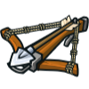

+ Damage: `9`
+ Damage per second: `17.3`
+ Range: `46m`

+ `hero.attack(target)`
+ `hero.attackRange`

___

### _OAK CROSSBOW_

Hits harder, and loads faster, but has less range than the Large Bolt Crossbow.

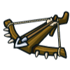

+ Damage: `9.5`
+ Damage per second: `19.0`
+ Range: `39m`

+ `hero.attack(target)`
+ `hero.attackRange`

___

### _HUNTING RIFLE_

Lower range and higher damage than the crossbows. The powerUp enables a 3x damage shot every 10 seconds.

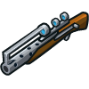

+ Damage: `15.87`
+ Damage per second: `19.6`
+ Range: `25m`

+ `hero.attack(target)`
+ `hero.attackRange`

#### _`hero.powerUp()`_ method

The hero powers up the next attack(s) with a weapon-specific powerup.

+ PowerUp: `+200%`
+ Cooldown: `10s`

___

### _SIMPLE RIFLE_

Faster than the hunting rifle, but without a special attack.

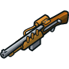

+ Damage: `13.28`
+ Damage per second: `22.2`
+ Range: `28m`

+ `hero.attack(target)`
+ `hero.attackRange`

___

### _BOOMROD_

Short range damage cannon. Enables Scattershot, which fires 6 times every 6 seconds in a 45 degree arc. Oy!

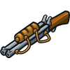

+ Damage: `14.37`
+ Damage per second: `22.7`
+ Range: `10m`

+ `hero.attack(target)`
+ `hero.attackRange`

#### _`hero.scattershot(target)`_ method

The `scattershot` ability releases a spray of shotsFactor missiles within an arc of arcFactor radians towards an optional target, or straight in front of the hero.

+ Scattershots: `6`
+ Arc: `0.78`
+ Cooldown: `6s`

___

### _BOLT SPITTER_

Very fast attack with knockback. Scattershot fires 3 bolts every 4th attack.

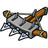

+ Damage: `8.3`
+ Damage per second: `33.2`
+ Range: `41m`

+ `hero.attack(target)`
+ `hero.attackRange`
+ `hero.scattershot(target)`

+ Scattershots: `3`
+ Arc: `0.52`
+ Cooldown: `1s`

___

### _BOLTSAW_

Low damage but extremely fast fire rate. The powerUp enables it to fire 3 shots at once every 2 seconds.

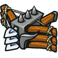

+ Damage: `8.75`
+ Damage per second: `35.0`
+ Range: `37m`

+ `hero.attack(target)`
+ `hero.attackRange`
+ `hero.powerUp()`

+ PowerUp: `+200%`
+ Cooldown: `2s`

___

### _LIGHTNING STICK_

Shoots a beam of high damage energy at long range.

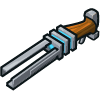

+ Damage: `40.49`
+ Damage per second: `44.6`
+ Range: `37m`

+ `hero.attack(target)`
+ `hero.attackRange`

___

### _IRON DEFENDER_

This short-range crossbow is ideal for close-quarters combat.

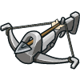

+ Damage: `64.79`
+ Damage per second: `88.9`
+ Range: `15m`

+ `hero.attack(target)`
+ `hero.attackRange`

#### _`hero.attackDamage`_ property

How much damage the hero does with each attack.

___

### _DEADEYE CROSSBOW_

Woe to the beastie that comes into your sights with this elegant, fast crossbow.

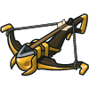

+ Damage: `39.67`
+ Damage per second: `94.5`
+ Range: `30m`

+ `hero.attack(target)`
+ `hero.attackDamage`
+ `hero.attackRange`

___

### _REINFORCED CROSSBOW_

This long-range crossbow can shoot nearly as far as you can see.

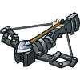

+ Damage: `74.93`
+ Damage per second: `93.7`
+ Range: `48m`

+ `hero.attack(target)`
+ `hero.attackDamage`
+ `hero.attackRange`

___

### _RAPIDFIRE RIFLE_

It's okay. It's steam-powered.

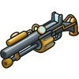

+ Damage: `33.17`
+ Damage per second: `132.7`
+ Range: `30m`

+ `hero.attack(target)`
+ `hero.attackDamage`
+ `hero.attackRange`

___

### _PRECISION RIFLE_

Legend tells of a master ranger who used this rifle to shoot out the left eye of Death itself.

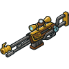

+ Damage: `112.91`
+ Damage per second: `158.4`
+ Range: `50m`

+ `hero.attack(target)`
+ `hero.attackDamage`
+ `hero.attackRange`

___

### _GIFT OF THE TREES_

The Goddess of Archery herself, sick of shooting just one arrow at a time, crafted this epic bow from the heartoak of Yggdrasil.

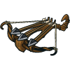

+ Damage: `59.39`
+ Damage per second: `162.7`
+ Range: `32m`

+ `hero.attack(target)`
+ `hero.attackDamage`
+ `hero.attackRange`
+ `hero.scattershot(target)`

+ Scattershots: `3`
+ Arc: `0.26`
+ Cooldown: `?`

___
