## _Weapon - Warrior_

___


**Table of Contents:**

* [Simple Sword](#simple-sword)
* [Roughedge](#roughedge)
* [Sharpened Sword](#sharpened-sword)
* [Simple Katana](#simple-katana)
* [Long Sword](#long-sword)
* [Short Sword](#short-sword)
* [Darksteel Blade](#darksteel-blade)
* [Great Sword](#great-sword)
* [Claymore](#claymore)
* [Edge of Darkness](#edge-of-darkness)
* [Kithsteel Blade](#kithsteel-blade)
* [Runesword](#runesword)
* [Sword of the Forgotten](#sword-of-the-forgotten)
* [Sword of the Temple Guard](#sword-of-the-temple-guard)

___

### _SIMPLE SWORD_

A simple introductory sword.


+ Damage: `6`
+ Damage per second: `12.0`

#### _`hero.attack(target)`_ method

The `attack` method makes the hero attack the `target` unit.

**Example:**

```javascript
// Attack an enemy named "Treg" twice.
hero.attack("Treg");
hero.attack("Treg");

// Attack the nearest enemy once, using a variable.
var enemy = hero.findNearestEnemy();
hero.attack(enemy);
```

**Required Parameters:**

+ `target`: `object` (ex. `hero.findNearestEnemy()`) - _The target enemy to attack_

___

### _ROUGHEDGE_

Deals more damage than the simple sword.

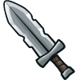

+ Damage: `12.06`
+ Damage per second: `15.4`

+ `hero.attack(target)`

___

### _SHARPENED SWORD_

Hits faster and has higher DPS than Roughedge.

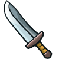

+ Damage: `10.8`
+ Damage per second: `16.6`

+ `hero.attack(target)`

___

### _SIMPLE KATANA_

Medium damage with a short cooldown, with a triple-damage knockback powerup every 5 seconds.

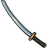

+ Damage: `16.31`
+ Damage per second: `27.9`

+ `hero.attack(target)`

#### _`hero.powerUp()`_ method

The hero powers up the next attack(s) with a weapon-specific powerup.

+ PowerUp: `x3` + `knockout`
+ Cooldown: `5s`

___

### _LONG SWORD_

Hits very hard with a long cooldown. Enables cleave, which does massive area of effect damage.

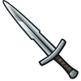

+ Damage: `27.62`
+ Damage per second: `28.0`

+ `hero.attack(target)`

#### _`hero.cleave(target)`_ method

Cleaves a `target` and anything around the hero within `10m` for `cleaveDamage` damage.

___

### _SHORT SWORD_

Very fast, low damage sword. Ideal for munchkin-slaying. Can also be used to carve Thanksgiving turkey.

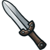

+ Damage: `8.9`
+ Damage per second: `35.6`

+ `hero.attack(target)`

___

### _DARKSTEEL BLADE_

Almost as fast as the short sword with much higher damage. Enables powerUp ability that speeds up attacks every 12 seconds.


+ Damage: `17.65`
+ Damage per second: `57.1`

+ `hero.attack(target)`
+ `hero.powerUp()`

+ PowerUp: `?`
+ Cooldown: `12s`

___

### _GREAT SWORD_

High damage, low cooldown. Powerup ability does 12x damage with heavy knockback every 12 seconds.

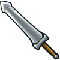

+ Damage: `16.37`
+ Damage per second: `65.5`

+ `hero.attack(target)`
+ `hero.powerUp()`

+ PowerUp: `x12` + `knockout`
+ Cooldown: `12s`

___

### _CLAYMORE_

Slightly more DPS than the great sword. The powerUp allows the next attack to hit from 10 meters away every 6 seconds.

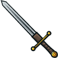

+ Damage: `27`
+ Damage per second: `69.2`

+ `hero.attack(target)`
+ `hero.powerUp()`

+ PowerUp: `rangeAttack`
+ Cooldown: `6s`

___

### _EDGE OF DARKNESS_

A hero must tread the razor edge between the light and the dark.

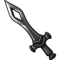

+ Damage: `55.81`
+ Damage per second: `114.1`

+ `hero.attack(target)`


#### _`hero.attackDamage`_ property

How much damage the hero does with each attack.

___

### _KITHSTEEL BLADE_

This blade reaches 7 meters instead of the usual 3. Strike first!

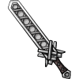

+ Damage: `45.03`
+ Damage per second: `114.9`
+ Range: `7m`

+ `hero.attack(target)`
+ `hero.attackDamage`


#### _`hero.attackRange`_ property

How far the hero's attack reaches, in meters.

___

### _RUNESWORD_

Only the mightiest of warriors can even lift the massive Runesword.

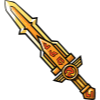

+ Damage: `228.57`
+ Damage per second: `192.2`

+ `hero.attack(target)`
+ `hero.attackDamage`

___

### _SWORD OF THE FORGOTTEN_

The fell origins of this ancient blade have been lost to time. It blasts its foes backwards with every blow.

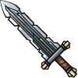

+ Damage: `105.73`
+ Damage per second: `211.5`

+ `hero.attack(target)`
+ `hero.attackDamage`

___

### _SWORD OF THE TEMPLE GUARD_

The greatest paladins of the land carried this blade into battle in days of yore.

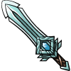

+ Damage: `53.58`
+ Damage per second: `206.1`

+ `hero.attack(target)`
+ `hero.attackDamage`

___
