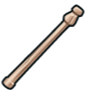

## _Weapon - Wizard_

___


**Table of Contents:**

* [Enchanted Stick](#enchanted-stick)
* [Simple Wand](#simple-wand)
* [Twisted Pine Wand](#twisted-pine-wand)
* [Oak Wand](#oak-wand)
* [Mahogany Staff](#mahogany-staff)
* [Balsa Staff](#balsa-staff)
* [Oak Sphere Staff](#oak-sphere-staff)
* [Banded Redwood Wand](#banded-redwood-wand)
* [Steel Wand](#steel-wand)
* [Obsidian Staff](#obsidian-staff)
* [Lightning Twig](#lightning-twig)
* [Crystal Wand](#crystal-wand)
* [Sulphur Staff](#sulphur-staff)
* [Golden Wand](#golden-wand)
* [Vine Staff](#vine-staff)

___

### _ENCHANTED STICK_

A beginner's wand. If you don't break it, you can have a nicer wand.


+ Damage: `8.45`
+ Damage per second: `11.3`
+ Range: `30m`

#### _`hero.attack(target)`_ method

The `attack` method makes the hero attack the `target` unit.

**Example:**

```javascript
// Attack an enemy named "Treg" twice.
hero.attack("Treg");
hero.attack("Treg");

// Attack the nearest enemy once, using a variable.
var enemy = hero.findNearestEnemy();
hero.attack(enemy);
```

**Required Parameters:**

+ `target`: `object` (ex. `hero.findNearestEnemy()`) - _The target enemy to attack_

#### _`hero.attackRange`_ property

How far the hero's attack reaches, in meters.

___

### _SIMPLE WAND_

Does less damage than the enchanted stick, but fires more quickly.


+ Damage: `8.6`
+ Damage per second: `13.2`
+ Range: `30m`

+ `hero.attack(target)`
+ `hero.attackRange`

___

### _TWISTED PINE WAND_

Higher damage and range than lower-level wands.


+ Damage: `8.75`
+ Damage per second: `14.6`
+ Range: `32m`

+ `hero.attack(target)`
+ `hero.attackRange`

___

### _OAK WAND_

Provides a root spell that can stop an enemy from moving for 5 seconds every 7.5 seconds.


+ Damage: `8.74`
+ Damage per second: `8.0`
+ Range: `30m`

+ `hero.attack(target)`
+ `hero.attackRange`

#### _`hero.cast("root", target)`_ method

Casts a `"root"` spell on `target` if within `30m`, preventing it from moving for `5s` every `7.5s`.

___

### _MAHOGANY STAFF_

Provides a force-bolt spell that can blast enemies in a line for 40 damage every 7.5 seconds.


+ Damage: `10.13`
+ Damage per second: `10.8`
+ Range: `10m`

+ `hero.attack(target)`
+ `hero.attackRange`

#### _`hero.cast("force-bolt", target)`_ method

Casts a `"force-bolt"` spell on `target` if within `10m`, striking it for `40` damage and passing through to hit additional targets in a straight line.

___

### _BALSA STAFF_

Provides a fling spell that can hurl a target away once every 7.5 seconds.



+ Damage: `9.9`
+ Damage per second: `10.9`
+ Range: `30m`

+ `hero.attack(target)`
+ `hero.attackRange`

#### _`hero.cast("fling", target)`_ method

Casts a `"fling"` spell on target if `30m`, flinging it away from the `hero`.

___

### _OAK SPHERE STAFF_

Provides a windstorm spell that can deflect all projectiles during active casting.


+ Damage: `12.31`
+ Damage per second: `19.2`
+ Range: `22m`

+ `hero.attack(target)`
+ `hero.attackRange`

#### _`hero.cast("windstorm", target)`_ method

Casts a `"windstorm"` spell centered on `target` if within `22m`, knocking back any physical missiles and buffeting units away from the epicenter.

___

### _BANDED REDWOOD WAND_

Provides a confuse spell that makes an enemy attack any nearby target for 5 seconds, once every 10 seconds.


+ Damage: `8.79`
+ Damage per second: `20.5`
+ Range: `10m`

+ `hero.attack(target)`
+ `hero.attackRange`

#### _`hero.cast("confuse", target)`_ method

Casts a `"confuse"` spell on `target` if within 10m, causing it to attack the nearest nearby unit without discrimination or run in a random direction. Lasts `5` seconds.

___

### _STEEL WAND_

Provides a magic-missile spell that can deal 130 damage every 9 seconds.


+ Damage: `28.57`
+ Damage per second: `24.0`
+ Range: `32m`

+ `hero.attack(target)`
+ `hero.attackRange`

#### _`hero.cast("magic-missile", target)`_ method

Casts a `"magic-missile"` spell on `target` if within `32m`, firing five magic missiles at it and doing up to `130` damage, also knocks enemy back with spells.magic-missile.mass kg of force.

___

### _OBSIDIAN STAFF_

This arcane staff can invoke a bizarre antigravity spell.


+ Damage: `39.75`
+ Damage per second: `37.0`
+ Range: `22m`

+ `hero.attack(target)`
+ `hero.attackRange`

#### _`hero.cast("antigravity", target)`_ method

Casts an `"antigravity"` spell on `target` if within `22m`, creating an `"antigravity"` field with a radius of spells.antigravity.radiusm around the target causing all ground units to drift into the sky and not be able to move for spells.antigravity.duration seconds.

___

### _LIGHTNING TWIG_

Lightning bolt! Lightning bolt!


+ Damage: `11.13`
+ Damage per second: `38.6`
+ Range: `50m`

+ `hero.attack(target)`
+ `hero.attackRange`

#### _`hero.cast("lightning-bolt", target)`_ method

Casts a `"lightning-bolt"` spell on `target`. Causes spells['lightning-bolt'].damage damage to `target` and spells['lightning-bolt'].splashFactorx splash damage to other enemies if within spells['lightning-bolt'].splashRangem.

___

### _CRYSTAL WAND_

The sorcerous power radiating from this crystal wand can trigger a deadly disintegration reaction.


+ Damage: `27.9`
+ Damage per second: `43.4`
+ Range: `29m`

+ `hero.attack(target)`
+ `hero.attackRange`

#### _`hero.cast("disintegrate", target)`_ method

Casts a `"disintegrate"` spell on `target` if within spells.disintegrate.rangem, doing spells.disintegrate.damage over one second.

___

### _SULPHUR STAFF_

This is it, the moment you were training for since you started wizarding: the fireball spell! Just, don't blow yourself up, okay?


+ Damage: `48.26`
+ Damage per second: `64.5`
+ Range: `54m`

+ `hero.attack(target)`
+ `hero.attackRange`

#### _`hero.cast("fireball", target)`_ method

Casts a `"fireball"` spell on `target` causing spells.fireball.damage if within spells.fireball.rangem, causes splash damage to targets within spells.fireball.radiusm of target.

___

### _GOLDEN WAND_

Summon forth a storm of gold coins from the sky with this golden wand.


+ Damage: `24.64`
+ Damage per second: `90.9`
+ Range: `40m`

+ `hero.attack(target)`
+ `hero.attackRange`

#### _`hero.cast("goldstorm")`_ method

Casts a `"goldstorm"` spell, spawning spells.goldstorm.amount gold scattering from a golden cloud which travels in a random direction from the caster.

___

### _VINE STAFF_

Channel the wrath of the forest to summon a gnarled burl to fight for you.


+ Damage: `70.76`
+ Damage per second: `94.3`
+ Range: `45m`

+ `hero.attack(target)`
+ `hero.attackRange`

#### _`hero.cast("summon-burl")`_ method

Casts a `"summon-burl"` spell to summon a mighty burl!

___
