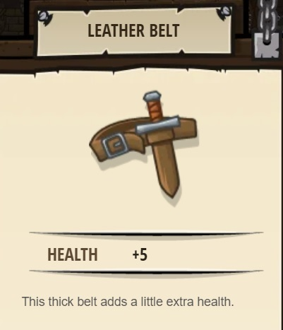
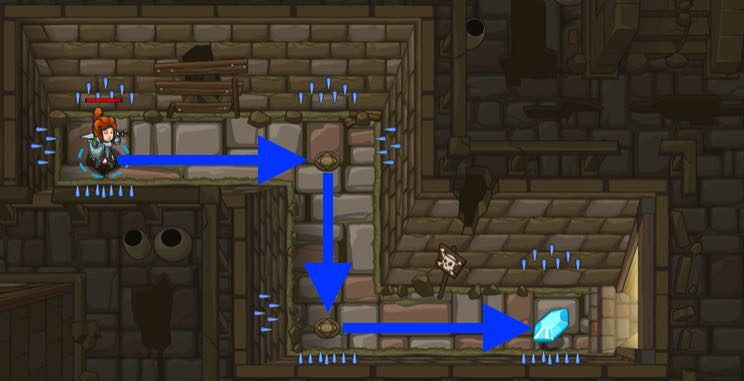

## _Dungeons Of Kithgard_

_So, here we are. On the start line of new adventure._ It's doesn't matter which hero you'll choose to play so far - they're all the same just looks different.

#### _Legend says:_
> Grab the gem and escape the dungeon but don’t run into anything else.
In this level, you’ll learn basic movements for your hero.

#### _Goals:_
+ _Avoid the spikes_
+ _Collect the gem_
+ _**Bonus**: Clean code (no warnings)_

#### _Topics:_
+ **Basic Sintax**

#### _Items we've got (- or need):_
+ Simple boots
+ _Optional: Elemental codex 1+_

 

#### _Solutions:_
+ **[JavaScript](dungeonsOfKithgard.js)**
+ **[Python](dungeons_of_kithgard.py "Top-10: 3.5s")**

#### _Rewards:_
+ 10-15 xp
+ 17-26 gems
+ Leather Belt (+5 max HP)



#### _Victory words:_
+ _YOU COMPLETED DUNGEONS OF KITHGARD!_

___

### _HINTS_

The journey begins! To escape the dungeon of Kithgard, your hero has to move. You tell them where to move by writing _code_. 

Type a code into the editor to give your hero instructions. Heroes read and execute these instructions themselves when told to. To direct your hero, refer to them in code with `hero`.

First level greets you with a brand new **_Simple boots_**. This equipment allows your hero to move using simple Up, Down, Left, Right commands.

Now that you know how to call on your hero, instruct them to move with direction commands, moveDown and moveRight. Write it like this:
```javascript
hero.moveDown();
hero.moveRight();
```
To pass this level, move right, down, and right to grab the gem. Remember, you only need three lines of code.



The code you write here is very similar to the code you might write to tell a computer how to do all kinds of things, from playing music to displaying a web page. You're taking your first steps towards being a coder!

___
