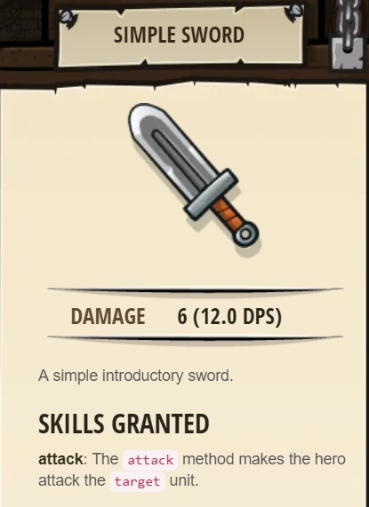
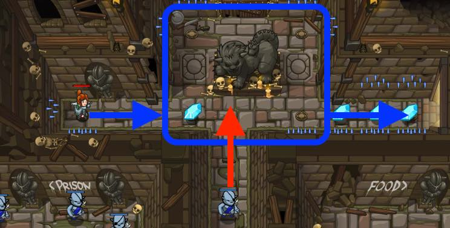

## _Shadow Guard_

_In the left bottom of the screen still running ogres. At the end of your way you'll see soldier kills ogre._

#### _Legend says:_
> Evade the charging ogre to grab the gems and get to the other side safely. Watch out for the spikes!

#### _Goals:_
+ _Don't run into the spokes_
+ _Collect all the gems_
+ _Don't let the ogre see you_
+ _**Bonus**: Clean code (no warnings)_

#### _Topics:_
+ **Basic Sintax**

#### _Items we've got (- or need):_
+ Simple boots
+ _Optional: Elemental codex 1+_
+ _Optional: The Precious ring_

#### _Solutions:_
+ **[JavaScript](shadowGuard.js)**
+ **[Python](shadow_guard.py "Top-20: 5s")**

#### _Rewards:_
+ 11-17 xp
+ 19-29 gems
+ Simple Sword

#### _Victory words:_
+ _YOU HAVE LEARNED THE VALUE OF NOT BEING SEEN._

___

### _HINTS_

Use cover to avoid being seen.

This is all about skills of secrecy. You don't have a weapon yet, so you can't fight the ogre munchkin who guards the path.

Instead, try moving up, behind the statue, so he doesn’t see you. Then you can get the gems and run to the finish undetected.

___
