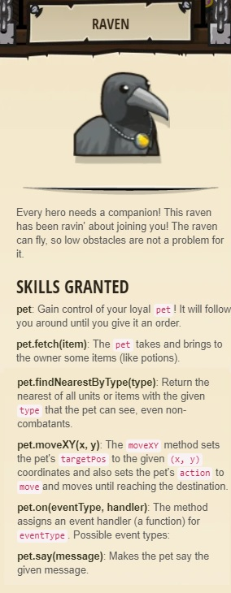

## _Fire Dancing_

#### _Legend says:_
> Save typing (and your hero) with loops!

#### _Goals:_
+ _Dodge the fireballs forever_
+ _Bonus: Under 4 statements_
+ _Bonus: Clean code (no warnings)_

#### _Topics:_
+ **Basic Sintax**
+ **While Loops**

#### _Items we've got (- or need):_
+ Simple boots

#### _Solutions:_
+ **[JavaScript](fireDancing.js)**
+ **[Python](fire_dancing.py)**

#### _Rewards:_
+ 11-23 xp
+ 10-20 gems
+ Raven companion



#### _Victory words:_
+ _JUMP TO THE LEFT. STEP TO THE RIGHT. REPEAT._

___

### _HINTS_


Avoid the fireballs by dancing **right** and **left**.

Use a **while-true loop** to repeat forever like this:

```javascript
while (true) {
	hero.moveLeft();  // This will happen over and over.
}
```

Code normally executes in the order it's written. **Loops** allow you to repeat a block of code multiple times without having to re-type it.

___
