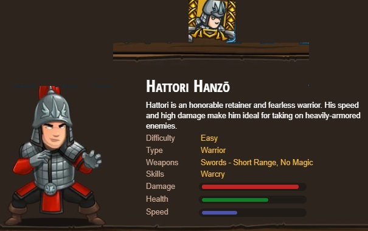

## _Favorable Odds_

#### _Legend says:_
> Two ogres bar your passage out of the dungeon.

#### _Goals:_
+ _Your hero must survive_
+ _Attack the two ogres_
+ _Grab the gem_
+ _Bonus: no code problems_

#### _Topics:_
+ **Basic Sintax**
+ **Arguments**
+ **Strings**

#### _Items we've got (- or need):_
+ Simple boots
+ _Optional: Elemental codex 1+_
+ _Optional: Emperor's gloves_

#### _Solutions:_
+ **[JavaScript](favorableOdds.js)**
+ **[Python](favorable_odds.py "#1 : 2.87s")**

#### _Rewards:_
+ 14-21 xp
+ 22-33 gems
+ Samurai hero

#### _Victory words:_
+ _MAY THE ODDS BE EVER IN YOUR FAVOR._

___

### _HINTS_

Remember to hit ogre munchkins twice, and to put their names capitalized in quotes: `"Krug"` and `"Grump"`.

If you buy a powerful sword, you can take down munchkins in one hit.

> _A programmer must have the deepest commitment, the most serious mind. ~ Yoda_

___
