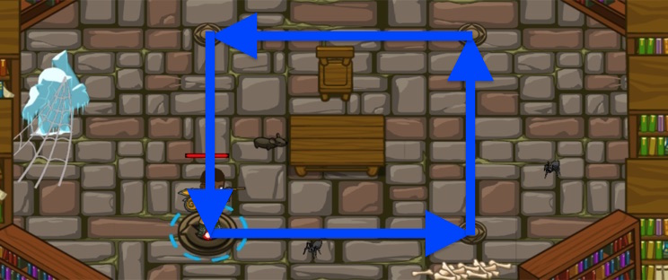

## _Lost in the Stacks_

#### _Legend says:_
> Use code blocks to find your way out of the library

#### _Goals:_
+ _Move around the room_
+ _Under 6 statements_

#### _Topics:_
+ **Basic Sintax**
+ **While Loops**
+ **Reading the Docs**

#### _Items we've got (- or need):_
+ Simple boots
+ _Optional: Elemental codex 1+_

#### _Solutions:_
+ **[JavaScript](lostInTheStacks.js)**
+ **[Python](lost_in_the_stacks.py "#2 - 5,93s")**

#### _Rewards:_
+ 20 xp
+ 16 gems

#### _Victory words:_
+ _NO HUMAN WOULD STACK BOOKS LIKE THIS._

___

### _HINTS_



So far, your code runs in order, line by line.

Now you will use **code blocks**: groups of commands that can be re-used over and over.

This is how you create a **code block**:

```javascript
// A code block starts with { and ends with }

while (true) {
	hero.moveRight();
	hero.moveUp();
	hero.moveLeft();
	hero.moveDown();
}
```

All of the movement commands are part of a `code block`.

The `while-true` command says: repeat the commands in the code block over and over.

**Code blocks** are very useful! 

Make sure you understand this, you will be using them a LOT in future levels!

In this level, the `while-true` loop command

```javascript
while (true) {
	hero.say("Start here");
	hero.say("Then say this.");
	hero.say("Now jump to the start line again!");
}
```

Tells your program to repeat the code inside the **code block** over and over!

___
