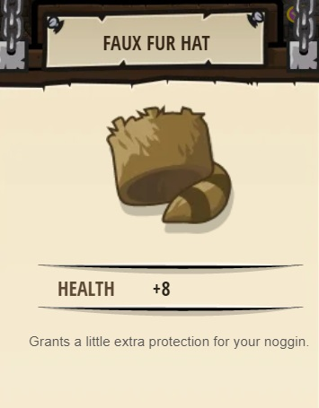
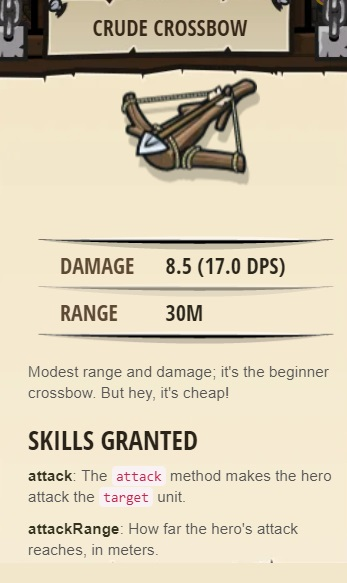
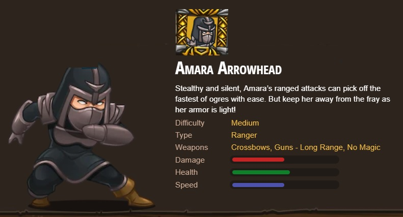
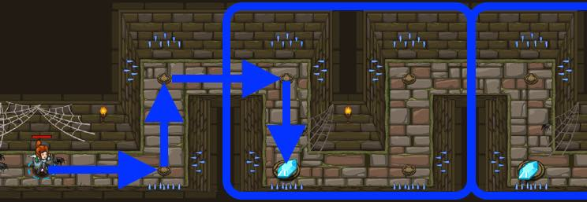

## _The Second Kithmaze_

#### _Legend says:_
> Many have tried, few have found their way through this maze.

#### _Goals:_
+ _Your hero must survive_
+ _Navigate the maze_
+ _Under 6 statement_

#### _Topics:_
+ **Basic Sintax**
+ **While Loops**

#### _Items we've got (- or need):_
+ Simple boots
+ _Optional: Elemental codex 1+_

#### _Solutions:_
+ **[JavaScript](theSecondKithmaze.js)**
+ **[Python](the_second_kithmaze.py "Top-10: 6,4s")**

#### _Rewards:_
+ 13-27 xp
+ 20-40 gems
+ Faux Fur Hat

+ Crude Crossbow

+ Ninja

#### _Victory words:_
+ _YOU FINISHED THE LOOP!_

___

### _HINTS_

Remember, you only need **one while-true loop**. It will repeat!

Carefully count how many movements you need inside your **while-true loop** to solve the maze!

Remember, you should only use one **while-true loop** per level, and make sure all your code is inside the loop.

Hover over the **while-true loop** documentation in the lower right to see an example.

___
