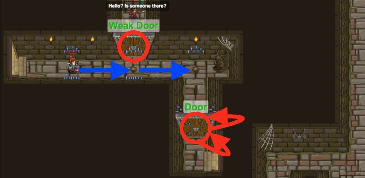

## _Breakout_

#### _Legend says:_
> Munchkins are chasing you, and the way ahead is blocked!

#### _Goals:_
+ _Free your friend_
+ _Break both doors_
+ _All humans survive_
+ _No code problems_
+ _Under 7 statements_

#### _Topics:_
+ **Basic Sintax**
+ **Arguments**
+ **Strings**
+ **While Loops**

#### _Items we've got (- or need):_
+ Boots
+ Weapon
+ _Optional: powerfull range weapon_

#### _Solutions:_
+ **[JavaScript](breakout.js)**
+ **[Python](breakout.py "#2: 3.27s")**

#### _Rewards:_
+ 30 xp
+ 27 gems

#### _Victory words:_
+ _BREAK IT DOWN!_

___

### _HINTS_

Free your friend by attacking the `"Weak Door"` so you have more time to break the stronger `"Door"` with a **while-true loop**.

You'll need that soldier to protect you, so first attack the `"Weak Door"` to free her.

Then use a **while-true loop** to attack the `"Door"` while your new friend holds off the munchkins.

___
