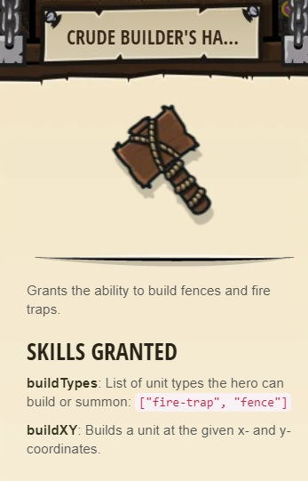
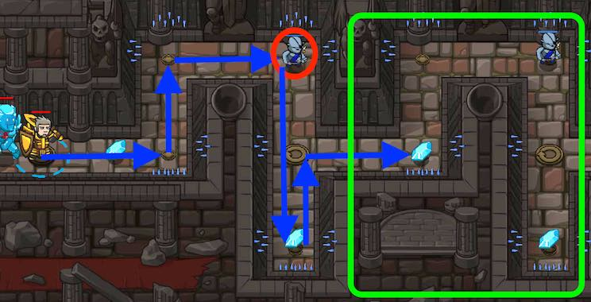

## _The Final Kithmaze_

#### _Legend says:_
> To escape you must find your way through an elder Kithman's maze.

#### _Goals:_
+ _Your hero must survive_
+ _Defeat the ogres_
+ _Navigate the maze_
+ _Collect the Gems_
+ _Under 10 statements_

#### _Topics:_
+ **Basic Sintax**
+ **Arguments**
+ **Variables**
+ **While Loops**

#### _Items we've got (- or need):_
+ Simple boots
+ _Optional: Elementals codex 1+_
+ _Optional: Emperor's gloves_

#### _Solutions:_
+ **[JavaScript](theFinalKithmaze.js)**
+ **[Python](the_final_kithmaze.py "Top-10: 10s")**

#### _Rewards:_
+ 20-40 xp
+ 26-52 gems
+ Crude Builder's Hummer

#### _Victory words:_
+ _YOU'RE DEADLY. INFINITELY DEADLY._

___

### _HINTS_

Be sure to call `findNearestEnemy()` only when you can see an enemy.

This level combines **while-true loops** and **variables** to both solve a maze and attack enemies.

Now you see why you need variables, because you're actually going to vary the data in the variable. 
Inside your while-true loop, if you define an `enemy` variable, it will refer to each of the three ogre munchkins in the level as the loop repeats. Cool, huh?

Pay attention to where your while-true loop should repeat so that you don't move further than you need to.

Make sure that you call `findNearestEnemy()` when you can actually see the ogre munchkin with clear line of sight.

___
