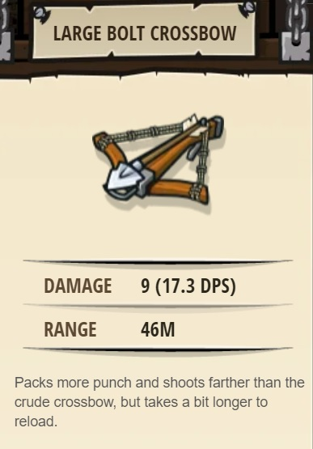

## _Lowly Kithmen_

#### _Legend says:_
> Use your glasses to seek out and attack the Kithmen.

#### _Goals:_
+ _Your hero must survive_
+ _Defeat the ogres_
+ _Collect the Gems_
+ _Bonus: no code problems_

#### _Topics:_
+ **Basic Sintax**
+ **Arguments**
+ **Variables**

#### _Items we've got (- or need):_
+ Simple boots
+ _Optional: Elementals codex 1+_
+ _Optional: Emperor's gloves_

#### _Solutions:_
+ **[JavaScript](lovelyKitchen.js)**
+ **[Python](lovely_kitchen.py "Top-5 : 3.2s")**

#### _Rewards:_
+ 21-32 xp
+ 30-45 gems
+ Large Bolt Crossbow

#### _Victory words:_
+ _A WORLD OF VARIABLE COMBAT UNFOLDS._

___

### _HINTS_

They say that you need great armor for the forest world.

Because you don't know the names of these ogres, you can use the `findNearestEnemy` method from your glasses to store references to the ogres in variables.

When you call the `findNearestEnemy` method, you **must store the result in a variable**, like `enemy2` (you can name it whatever you want). The variable will remember what the nearest enemy **was** when you called the `findNearestEnemy` method, so make sure to call it when you see a nearby enemy.

Remember: when you use quotes, like `"Kratt"`, you are making a **string**. When you don't use quotes, like `enemy1`, you are referencing the `enemy1` **variable**.

___
