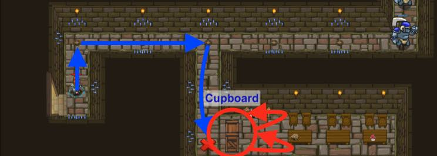

## _Cupboards of Kithgard A_

#### _Legend says:_
> Who knows what horrors lurk in the Cupboards of Kithgard?

#### _Goals:_
+ _Break open the Cupboard_
+ _Under 7 statements_

#### _Topics:_
+ **Basic Sintax**
+ **Arguments**
+ **Strings**
+ **While Loops**

#### _Items we've got (- or need):_
+ Simple boots
+ _Optional: Elementals codex 1+_
+ _Optional: Emperor's gloves_

#### _Solutions:_
+ **[JavaScript](cupboardsOfKithgardA.js)**
+ **[Python](cupboards_of_kithgard_a.py "#1 : 5.67s")**

#### _Rewards:_
+ 18 xp
+ 18 gems

#### _Victory words:_
+ _SOMEONE NEEDS TO CLEAN OUT THESE CUPBOARDS MORE OFTEN._

___

### _HINTS_



You can perform any action before a **while-true loop**.

```javascript
hero.moveUp();
while (true) {
    hero.attack("Brak");
}
```

The ogre guards might be too much for you to handle. Maybe you'll find something useful in the `"Cupboard"`?

First, move close to the `"Cupboard"` (stand on the red X). It looks locked, so you'll have to attack it repeatedly using a **while-true loop** to break it open.

___
