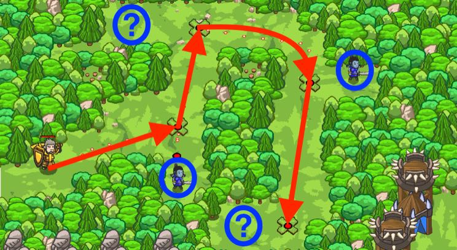

## _Backwoods Ambush_

#### _Legend says:_
> Conditionally ambush some ogre sentries in the backwoods.

#### _Goals:_
+ _Defeat the ogres_
+ _Bonus: clean code (no warnings)_

#### _Topics:_
+ **Basic Sintax**
+ **Arguments**
+ **Variables**
+ **If Statements**

#### _Items we've got (- or need):_
+ Fast boots
+ _Optional: Elemental codex 1+_

#### _Solutions:_
+ **[JavaScript](backAmbush.js)**
+ **[Python](back_ambush.py)**

#### _Rewards:_
+ 35-52 xp
+ 42-62 gems

#### _Victory words:_
+ _THE AMBUSHERS HAVE BECOME THE AMBUSHEES!_

___

### _HINTS_



Use `moveXY` to patrol the forest.

You now have access to the powerful `if`-statements. Check your toolbar in the `middle` for the **Programmaticon II** for extra information.

Use an `if`-statement to check the **existence** of an enemy:

```python
enemy = hero.findNearestEnemy()
if enemy:
    # Attack!
    pass

```

___

Your new Programmaticon II grants you the ability to use **if-statements**.

An **if-statement** says, **if** some condition is true, then run some code (if it's not true then don't run the code!)

To complete this level, you should move to each of the X marks with `moveXY`.

At each X spot, there may or may not be an ogre (the ogres are spawned randomly each time you press the Submit button!).

So use `findNearestEnemy` and `if` statements to determine if an ogre is at each spot, like this:

```python
enemy = hero.findNearestEnemy()
if enemy:
    hero.attack(enemy)
```

When you use an `if` statement this way, you won't get an error by trying to attack an enemy when there is no one there!

___
