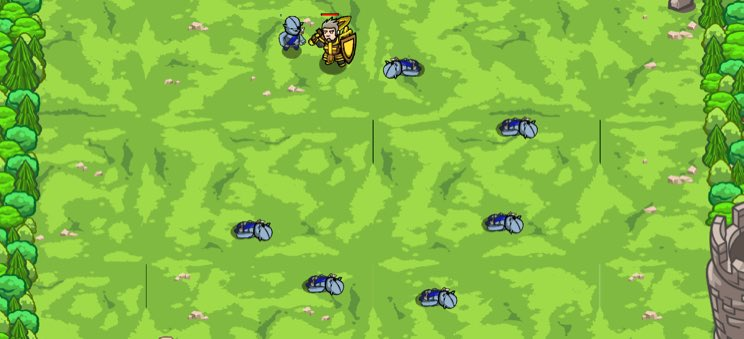

## _Patrol Buster_

#### _Legend says:_
> Defeat ogre patrols with new, selective targeting skills.

#### _Goals:_
+ _Your hero must survive_
+ _Bonus: clean code (no warnings)_

#### _Topics:_
+ **Basic Sintax**
+ **Arguments**
+ **Variables**
+ **If Statements**
+ **While Loops**

#### _Items we've got (- or need):_
+ Weapon

#### _Solutions:_
+ **[JavaScript](patrBust.js)**
+ **[Python](patr_bust.py)**

#### _Rewards:_
+ 74-112 xp
+ 74-112 gems

#### _Victory words:_
+ _PAUSE AND CONSIDER EXISTENCE BEFORE CODING._

___

### _HINTS_



`if`-statements are fundamental tool for programmers. Create them by typing:

```javascript
var enemy = hero.findNearestEnemy();
if (enemy) {
    hero.attack(enemy);
}

```

___

Your new Programmaticon II grants you the ability to use **if-statements**. They let you run code only if a certain condition is true.

In this level, you want to attack the nearest enemy, but only if there is an enemy. Use an **if-statement** with `enemy` as the condition to do that.

```javascript
var enemy = hero.findNearestEnemy();
if (enemy) {
    hero.attack(enemy);
}
```

Remember to hover over the `if/else` and read the example code in the **lower right** to see what the syntax should be.

___
