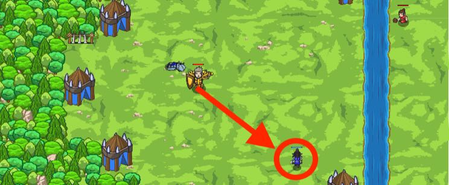

## _If-stravaganza_

#### _Legend says:_
> Surrounded on all sides by incoming ogres! Wait for the right time to attack, then strike!

#### _Goals:_
+ _Defeat the ogres_

#### _Topics:_
+ **Basic Sintax**
+ **Arguments**
+ **Variables**
+ **If Statements**
+ **While Loops**

#### _Items we've got (- or need):_
+ Weapon

#### _Solutions:_
+ **[JavaScript](ifStravaganza.js)**
+ **[Python](if_stravaganza.py)**

#### _Rewards:_
+ 53 xp
+ 33 gems

#### _Victory words:_
+ _UNFORTUNATELY DINNER WASN'T INCLUDED WITH THE SHOW._

___

### _HINTS_

Defend aginst ogres using an `if`-statement to check if here is an ogre nearby!

Do not attack if no munchkin around! You'll confuse the hero.

In this level, you need to check whether or not a munchkin exists when searching, and to attack it if it does exist.

___
