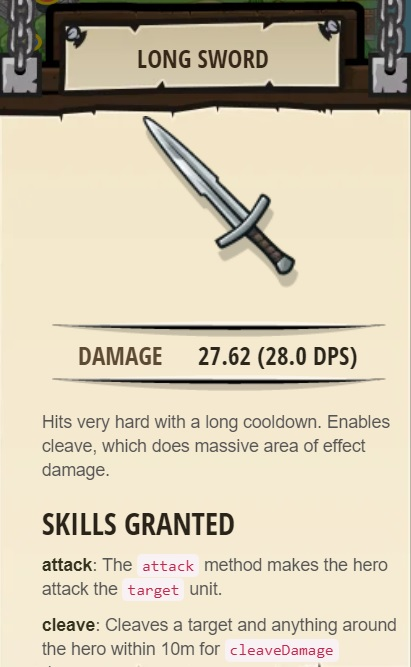
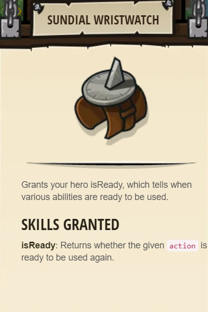
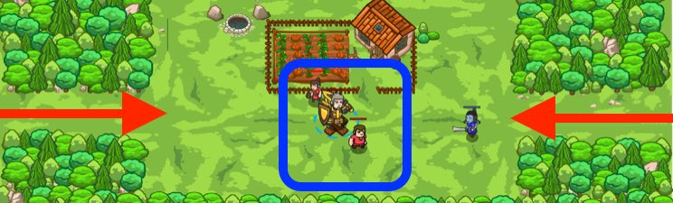

## _Back to Back_

#### _Legend says:_
> Patrol the village entrances, but stay defensive.

#### _Goals:_
+ _Villagers must survive_
+ _Elimininate the ogres_
+ _Bonus: cleen code (no warnings)_

#### _Topics:_
+ **Basic Sintax**
+ **Arguments**
+ **Variables**
+ **While Loops**
+ **If Statements**
+ **If/else Statements**

#### _Items we've got (- or need):_
+ Weapon

#### _Solutions:_
+ **[JavaScript](backBlack.js)**
+ **[Python](back_black.py)**

#### _Rewards:_
+ 35-52 xp
+ 41-61 gems
+ **Long Sword**



+ **Sundial Wristwatch**



#### _Victory words:_
+ _YOU'VE GOT EYES IN THE BACK OF YOUR HEAD!_

___

### _HINTS_



Expand your code's possibilities by using `else`!

`else` is just like `if`, except it contains the code that should run when the `if` condition is `false`:

```javascript
if(enemy) {
    // This happens when there is an enemy.
    hero.attack(enemy);
} else {
    // This happens when there is no enemy.
    hero.say("I don't see an enemy!");
}
```

___

This level introduces the `else` part of `if/else`.

When you add an `else` clause, you choose what to do both when the condition is true and when it is not true.

So you can say, _if_ there is an enemy, _then_ attack it, _else_ move to the X.

To show you how it works, the `if` and the `else` are set up for you, and you need to put in the `attack` and `moveXY` methods so that your hero attacks enemies on sight, but when there are no enemies, moves back to the X marker to defend the peasants.

Make sure you get the coordinates for the X marker correct, or you might not be able to defend both your peasants in time.

___
