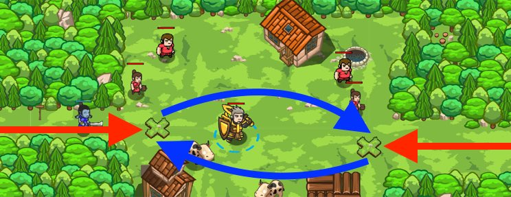

## _Village Guard_

#### _Legend says:_
> Defend a village from marauding munchkin mayhem.

#### _Goals:_
+ _Stop all the ogres_
+ _Save all the peasants_

#### _Topics:_
+ **Basic Sintax**
+ **Arguments**
+ **Variables**
+ **While Loops**
+ **If Statements**

#### _Items we've got (- or need):_
+ Weapon
+ If you wearing Ring of Speed - take it off.

#### _Solutions:_
+ **[JavaScript](village.js)**
+ **[Python](village.py)**

#### _Rewards:_
+ 51 xp
+ 64 gems

#### _Victory words:_
+ _USE AGGRESSION ONLY WHEN NEEDED._

___

### _HINTS_



Patrol the village's entry points and use an `if`-statements to check for enemies.

```python
hero.moveXY(60, 31)
rightEnemy = hero.findNearestEnemy()
if rightEnemy:
    hero.attack(rightEnemy)
```

You can do this level with two **if-statements**.

The first one, with `leftEnemy`, is in the default code as an example, so reload the sample code if you get off track.

Move to the X on the right, then define a `rightEnemy` variable with your `findNearestEnemy` method. Then, write an **if-statement** to check if `rightEnemy` exists. If there is an enemy, attack it!

Make sure that you define the `rightEnemy` variable when you would be able to see an enemy coming on the right.

___
