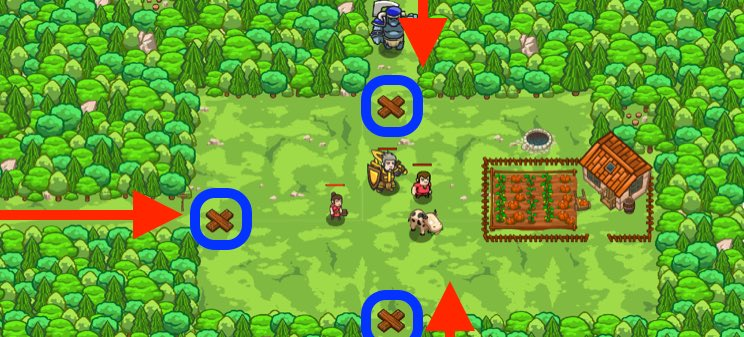

## _Thornbush Farm_

#### _Legend says:_
> Determine refugee peasant from ogre when defending the farm.

#### _Goals:_
+ _Stop all the ogres_
+ _Save all the peasants_

#### _Topics:_
+ **Basic Sintax**
+ **Arguments**
+ **Strings**
+ **Variables**
+ **While Loops**
+ **If Statements**

#### _Items we've got (- or need):_
+ Weapon

#### _Solutions:_
+ **[JavaScript](thorn.js)**
+ **[Python](thorn.py)**

#### _Rewards:_
+ 34 xp
+ 42 gems

#### _Victory words:_
+ _THE THORNBUSH FARM IS SAFE AND SOUND._

___

### _HINTS_



Patrol around the three entrances, and build a `"fire-trap"` at each `X` if you see an enemy.

Build a `"fire-trap"` the same way you build `"fecne"`, just with a differenet string:

```javascript
hero.buildXY("fire-trap", 20, 20);
```

Ogres are coming from the top, left, and bottom, so you need three sets of commands in your **loop**: one for `top`, one for `left`, and one for `bottom`.

Write the `left` and `bottom` code based on the `top` sample code.

Make sure that in each set of commands, you:
1. First, `moveXY` to the **X** marker
2. Define a new enemy variable with `findNearestEnemy` **after** you get to the marker
3. Write an if statement: _if_ there is an enemy, _then_ build a `"fire-trap"` on the **X** marker

After that, your loop will repeat to patrol all three entrances several times.

You only want to build a fire trap if you see an ogre coming, because otherwise a peasant will try to get into the village only to be blown to smithereens by your fire trap!

If you are getting stuck, look very closely at the `top` part to make sure your code is formatted the same way for `left` and `bottom`.

___
