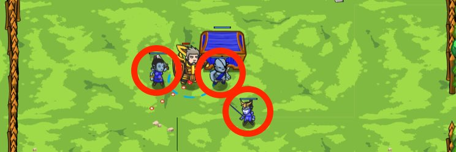

## _Ogre Encampment_

#### _Legend says:_
> Recover stolen treasure from an ogre encampment

#### _Goals:_
+ _Break open the chest_
+ _Bonus: clean code (no warnings)_

#### _Topics:_
+ **Basic Sintax**
+ **Strings**
+ **Variables**
+ **While Loops**
+ **If Statements**
+ **If/else Statements**

#### _Items we've got (- or need):_
+ Weapon

#### _Solutions:_
+ **[JavaScript](ogre.js)**
+ **[Python](ogre.py)**

#### _Rewards:_
+ 36-54 xp
+ 45-67 gems

#### _Victory words:_
+ _WHAT ELSE OF OURS DO THEY HAVE?_

___

### _HINTS_



If there is an enemy `attack` it, otherwise `attack` the `"Chest"`

```javascript
// Use if/else

var enemy = hero.findNearestEnemy();

if (enemy) {
    hero.attack(enemy);
} else {
    // ...
}
```

For this level, you'll need to use both `if` and `else`. Remember that the `else` block executes when the `if` condition is not true.

When the ogres attack you, you want to fight back, but when there are no ogres, you can keep attacking the `"Chest"` to open it. So in your `if` condition, check whether there is an enemy. If there is, attack it. Else, attack the `"Chest"`.

To remember the `if/else` syntax, either hover over the `if/else` examples in the lower right, from your Programmaticon II.

___
