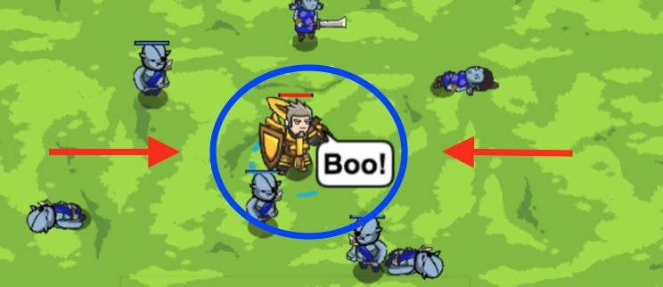

## _Backwoods Standoff A_

#### _Legend says:_
> More munchkins to practice cleaving on. Roooar!

#### _Goals:_
+ _Wipe out the camp_

#### _Topics:_
+ **Basic Sintax**
+ **Strings**
+ **Arguments**
+ **While Loops**
+ **If Statements**
+ **If/else Statements**

#### _Items we've got (- or need):_
+ Long Sword

#### _Solutions:_
+ **[JavaScript](standA.js)**
+ **[Python](stand_a.py)**

#### _Rewards:_
+ 60 xp
+ 71 gems

#### _Victory words:_
+ _MUNCHKINS ARE RIGHT TO BE AFRAID OF YOU!_

___

### _HINTS_

The munchkins are attacking! Use an if/else statement to perform an alternate action while `cleave` is on cooldown.

`if` `cleave` `isReady`, use it!

`else` `attack` the nearest enemy.

___
