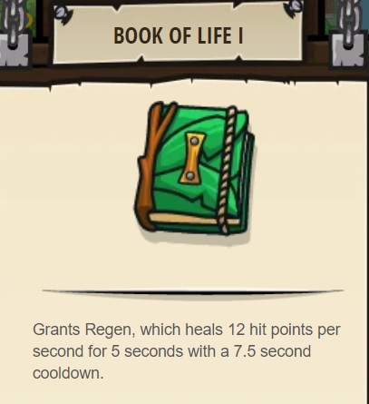

## _Touch of Death_

#### _Legend says:_
> Learn your first spell to siphon life from your foes.

#### _Goals:_
+ _Drain life from ogres to stay alive_

#### _Topics:_
+ **Strigns**
+ **Variables**
+ **While Loops**
+ **If Statements**
+ **If/else Statements**
+ **Nested If Statements**

#### _Items we've got (- or need):_
+ Unholy Tome 1+

#### _Solutions:_
+ **[JavaScript](deathTouch.js)**
+ **[Python](death_touch.py)**

#### _Rewards:_
+ 85 xp
+ 93 gems
+ **Book of Life I**

#### _Victory words:_
+ _MAGIC COURSES THROUGH YOUR FINGERS!_

___

### _HINTS_

With your upgraded glasses, you can use `distanceTo` to measure the distance, in meters, to a target unit or position. In this level, you'll use that to drain the life from munchkins that come too close.

You'll need to use the **less-than** operator: `<`.

You can read it like this: _if_ the distance is _less than_ 15m, _then_ cast `"drain-life"` on the enemy, _else_ attack the enemy with your staff.

Hover over the documentation in the lower right to see how to use your `"drain-life"` spell. Your staff does area-effect damage, so you want to use it at long range and when you are at full health, then switch to draining life to stay alive when the munchkins are hitting you.

If you get stuck, try doing Peasant Protection and Munchkin Swarm to apply what you learned about choosing different abilities based on distance to enemies.

___
