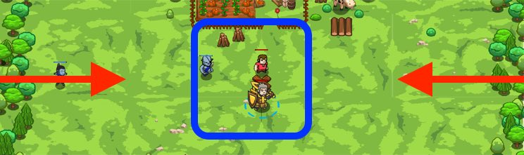

## _Peasant Protection_

#### _Legend says:_
> Stay close to Victor.

#### _Goals:_
+ _Repel the ogres_
+ _Humans must survive_

#### _Topics:_
+ **Basic Syntax**
+ **Variables**
+ **While Loops**
+ **If Statements**
+ **If/else Statements**
+ **Boolean Greater/Less**

#### _Items we've got (- or need):_
+ Weapon
+ Glasses

#### _Solutions:_
+ **[JavaScript](peasProt.js)**
+ **[Python](peas_prot.py)**

#### _Rewards:_
+ 63 xp
+ 74 gems

#### _Victory words:_
+ _TIGHT AND DEFENSIVE, THAT'S THE KEY._

___

### _HINTS_



If an enemy gets too close to you, `attack` it! Otherwise, `moveXY` to the **X** to stay close to the peasant.

Remember, you can find the distance using:

```javascript
var distance = hero.distanceTo(enemy);
```

You can use `distanceTo` to measure the distance, in meters, to a target. In this level, you'll use that to make sure you stay close to vulnerable peasant Victor.

You can see a new piece of syntax here, the **less-than** operator: `<`

You can read it like this: _if_ the distance is _less than_ 10 meters, _then_ attack the enemy, _else_ move back to the **X** marker.

Fill in the `else` to move back to the X so that no ogres can get to Victor while you're far away.

_Tip: : make sure that you are moving to the correct defensive position–the **X** is at `{x: 40, y: 37}`._

___
