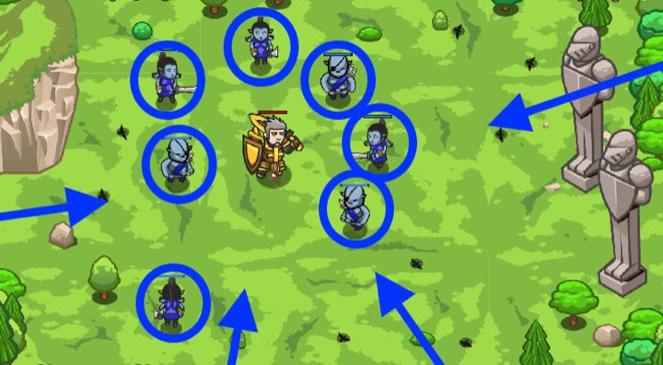

## _Munchkin Harvest_

#### _Legend says:_
> Join forces with a new hero: Amara Arrowhead.

#### _Goals:_
+ _Harvest the munchkins_

#### _Topics:_
+ **Strings**
+ **Variables**
+ **While Loops**
+ **If Statements**
+ **If/else Statements**
+ **Nested If Statements**

#### _Items we've got (- or need):_
+ Weapon
+ Armor (500+ HP)

#### _Solutions:_
+ **[JavaScript](munchHarv.js)**
+ **[Python](munch_harv.py)**

#### _Rewards:_
+ 71 xp
+ 81 gems
+ **Crude Dagger**

#### _Victory words:_
+ _YOU CAN NOW PURCHASE AMARA IN THE HERO SHOP._

___

### _HINTS_

Challenge level! If you can defeat this many ogre munchkins, you'll unlock few levels to test your rangers.

Check your equipment, you need a better set than your old dungeon armor.

Make sure that you have enough armor to defeat the ogres. You will probably need more than 500 health to survive. If you don't have enough, come back later when you've earned more gems.

Use your `isReady`, `cleave`, and `attack` skills to defeat the ogres. Shielding won't work.

___
