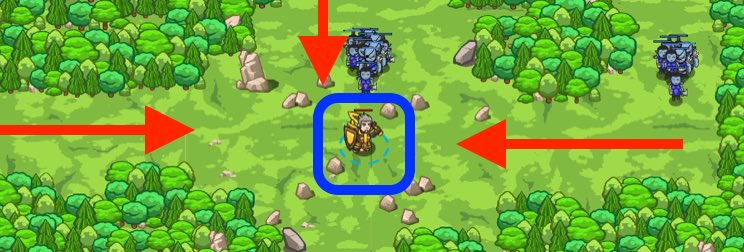

## _The Agrippa Defense_

#### _Legend says:_
> Let the enemy close, then strike when the moment is right.

#### _Goals:_
+ _Rid the meadow of ogres_

#### _Topics:_
+ **Strings**
+ **Variables**
+ **While Loops**
+ **If Statements**
+ **If/Else Statements**
+ **Nested If Statements**

#### _Items we've got (- or need):_
+ Long Sword

#### _Solutions:_
+ **[JavaScript](agrippa.js)**
+ **[Python](agrippa.py)**

#### _Rewards:_
+ 74 xp
+ 74 gems

#### _Victory words:_
+ _THAT DEFINITELY CANCELED OUT THEIR THIBAULT!_

___

### _HINTS_



Don't waste your `cleave()` on only a few enemies. Be smart with `distanceTo()` top catch as many as possible.

```javascript
// Find the distance to the enemy with distanceTo.
var distance = hero.distanceTo(enemy);

// If the distance is less than 5 meters...
if (distance < 5) {
    // If 'cleave' is ready, cleave!
    if (hero.isReady("cleave")) {
        hero.cleave();
    }
    // else, just attack
    else {

    }
}
```

Sometimes it's best not to open with your strongest attack immediately. If you cleave at the first sight of the enemy, you may only catch the first few, leaving their friends to finish you off!

Try using `distanceTo()` to wait until the enemy is closer before you cleave. You can experiment to find the best range at which to strike; in this level, around **5 meters** works well.

**Hint:** If your cleave isn't ready, don't just stand there! Use a normal `attack()` while you wait for it to be ready again.

___
