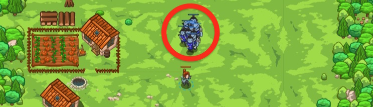

## _Leave it to Cleaver_

#### _Legend says:_
> Defend the homestead with function parameters.

#### _Goals:_
+ _Defeat the ogres_

#### _Topics:_
+ **Strings**
+ **Variables**
+ **While Loops**
+ **If Statements**
+ **If/Else Statements**
+ **Nested If Statements**

#### _Items we've got (- or need):_
+ Long Sword

#### _Solutions:_
+ **[JavaScript](leaveItCleave.js)**
+ **[Python](leave_it_cleave.py)**

#### _Rewards:_
+ 80 xp
+ 45 gems

#### _Victory words:_
+ _CAN'T FIGHT THE CLEAVER!_

___

### _HINTS_



The function `cleaveWhenClose` defines a parameter called `target`:

```javascript
function cleaveWhenClose(target) {
    if(hero.distanceTo(target) < 5) {
        // cleave or attack here
    }
}
```

This allows you to pass the enemy as an argument when calling the function:

```javascript
cleaveWhenClose(enemy);
```

___

In previous levels, you've passed _arguments_ to functions. When you do `hero.say("Hello!")`, you are passing the String `"Hello!"` as an argument to the function `say`.

Now, you'll learn to define _parameters_, which is what _arguments_ are called when defining our own functions.

For this level, you define a function called `cleaveWhenClose` that accepts a parameter called `target`:

```javascript
function cleaveWhenClose(target) {
    if(hero.distanceTo(target) < 5) {
        // cleave or attack here
    }
}
```

Note that when you call the function later, it says:

```javascript
cleaveWhenClose(enemy);
```

`enemy` is what the enemy is called outside the function, `target` is what the enemy is called inside the function. This is two different variables that both point to the same ogre!

___
