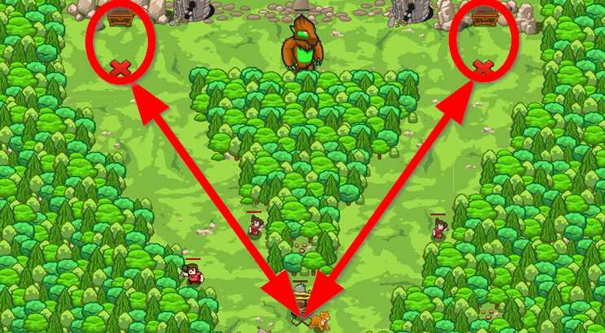

## _Short-sighted Burl_

#### _Legend says:_
> Sometimes you should be quiet, but how can you be with lots of gold in your hands?

#### _Goals:_
+ _Collect 4 gold coins_

#### _Topics:_
+ **Basic Syntax**
+ **Variables**
+ **While Loops**
+ **If Statements**
+ **Accessing Properties**
+ **Functions**

#### _Items we've got (- or need):_
+ **Not so fast hero**

#### _Solutions:_
+ **[JavaScript](shortBurl.js)**
+ **[Python](short_burl.py)**

#### _Rewards:_
+ 79 xp
+ 45 gems

#### _Victory words:_
+ _BE KIND TO THE BLIND._

___

### _HINTS_



The old burl guards chests with gold. Luckily it's short-sighted and can't see you when you are far away. But if the burl catches sight of you, then it will follow you.

Visit the red marks near each chest and look for coins. Return to the start point in between each check.

Use the function `takeItem` to collect an item and write a function named `checkTakeRun`.

If you have problems with this level, then maybe you need to return and play to previous levels about the functions. If you forget how to define a function, then look at this example:

```javascript
function checkSomething(something) {
    hero.say("I'm in the function!");
    // Check something
}
```

___
