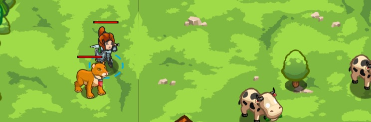

## _Backwoods Buddy_

##### There's a gem here :)

#### _Legend says:_
> You have a pet! Train her to speak!

#### _Goals:_
+ _Train your pet to speak_

#### _Topics:_
+ **Basic Syntax**
+ **Arguments**
+ **Strings**
+ **Functions**

#### _Items we've got (- or need):_
+ Pet

#### _Solutions:_
+ **[JavaScript](backBuddy.js)**
+ **[Python](back_buddy.py "Top-10: 5 gold")**

#### _Rewards:_
+ 79 xp
+ 45 gems

#### _Victory words:_
+ _PURR._

___

### _HINTS_



You have a pet!

Your pet responds to **events**. When she hears something, a `"hear"` event is triggered.

To have your pet respond to a `"hear"` event, you use a **handler function**:

```javascript
function speak(event) {
    pet.say("Meow!");
}

pet.on("hear", speak);
```

This level introduces pets! Yay!

You refer to your pet using `pet`, just like you refer to your hero using `hero`.

You train your pet to do things by using **event handlers**.

An **event** is something that happens that your pet can react to, such as `"hear"`ing you speak!

An **event handler** is a function that will be executed when an **event** happens.

To train your pet to react to an **event**, use the `on()` function:

```javascript
pet.on("hear", speak);
```

This means your pet will execute the function `speak()` when it `"hear"`s someone say something.

___
