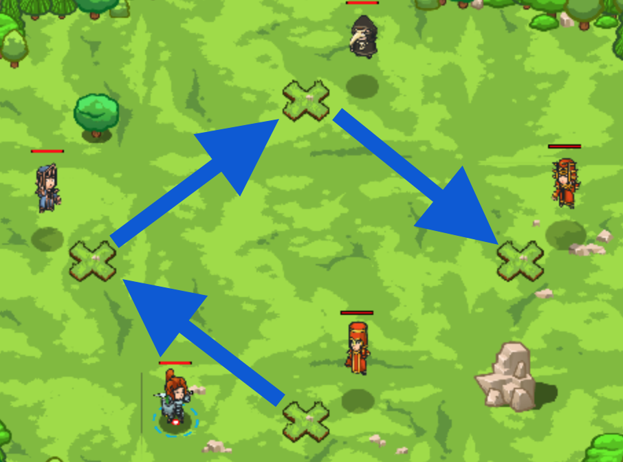

## _The Wizard's Door_

#### _Legend says:_
> Use mathematical programming to find the door to the wizards' secret lair.

#### _Goals:_
+ _Discover the door to the wizards lair._

#### _Topics:_
+ **Basic Syntax**
+ **Arguments**
+ **Arithmetics**
+ **Variables**

#### _Items we've got (- or need):_
+ Pet

#### _Solutions:_
+ **[JavaScript](wizDoor.js)**
+ **[Python](wiz_door.py)**

#### _Rewards:_
+ 60 xp
+ 71 gems

#### _Victory words:_
+ _I WONDER WHAT WONDERS AWAIT!_

___

### _HINTS_



The wizards guard a hidden door to a secret lair full of magic and treasure! 

To gain access, you'll need to use math to compute magic numbers.

Listen carefully to what each wizard says to figure out how to calculate each magic number. You'll need to take things one wizard at a time.

Look at the Hints to learn how to write out math formulas in code.

To help work through these problems, create variables to store each of the wizard's results.

```javascript
var sim = erz / 4;
```

Move to the next wizard using `moveXY`;

```javascript
hero.moveXY(30, 39);
```

Be sure to say the answer for the wizard!

```javascript
hero.say(sim);
```

For the answer for Agata, use the multiplication operator: `*`

```javascript
var aga = sim * las;
```

Finally, move in front of Agata and say her password!

In this level, you walk around to each wizard, following their instructions to calculate the magic numbers you need to speak. 

You'll have to edit and run your program multiple times to get all the instructions; take it one step at a time and you'll work your way through it.

Because the secret number is randomly chosen, you can't just do the math in your head! You'll have to write code to figure out each of the secret numbers.

Doing math in code is mostly like doing it on paper, but with a few key differences. To add or subtract, you use the plus (`+`) and minus (`-`) signs:

```javascript
var a = 4 + 5;   // a = 9
var b = 7 - 3;   // b = 4
```

But to multiply you use the asterisk (`*`) symbol:

```javascript
var a = 2 * 3;  // a = 6
```

And to divide you use the slash (`/`) symbol:

```javascript
var a = 6 / 2;  // a = 3
```

When you divide two numbers, there might be a remainder. You can use the modulo (`%`) operation to find out what the remainder is:

```javascript
var a = 7 % 3;  // a = 1
var c = 9 % 5;  // b = 4
var a = 8 % 4;  // c = 0 (no reminder)
```

You've already been using _variables_ to hold on to things like enemies, but you can use variables to hold anything! In the examples above, `a`, `b`, and `c` are variables that hold number values. When a variable holds a number value, you can use it in a math formula just like any other number:

```javascript
var a = 3 * 4;  // a = 12
var c = a / 6;  // b = 12 / 6 = 2
var a = b + a;  // c = 2 + 12 = 14
```

Using variables in math calculations is super important for solving this level.

___
