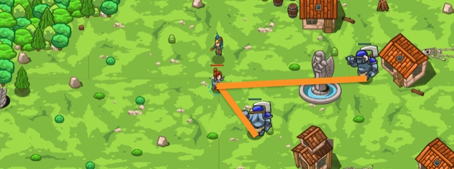

## _Blind Distance_

#### _Legend says:_
> We are ready to shoot! Distance - 300 kilometres! Direction angle - ... Who cares about direction!?

#### _Goals:_
+ _Defeat the ogres_

#### _Topics:_
+ **Variables**
+ **While Loops**
+ **If Statements**
+ **Functions**
+ **Return Statement**
+ **Boolean Greater/Less**

#### _Items we've got (- or need):_
+ Weapon

#### _Solutions:_
+ **[JavaScript](blind.js)**
+ **[Python](blind.py)**

#### _Rewards:_
+ 89 xp
+ 49 gems

#### _Victory words:_
+ _A METER? A YARD? IT'S ALL THE SAME TO THE BLIND WIZARDS!_

___

### _HINTS_



That village is too quiet. Looks like it's an ambush. The blind wizard is your only friend, but he is a really powerful mage. You will be the spotter for him. Watch for ogres and say the distance for any incoming. The wizard's powers are limited, use them **only when see an ogre**.

Use the predefined function that finds the nearest enemy and returns the distance to it (or 0 if no enemy). You can use function result in your code if you store it in a variable.

```javascript
var enemy = hero.findNearestEnemy();
```

___


