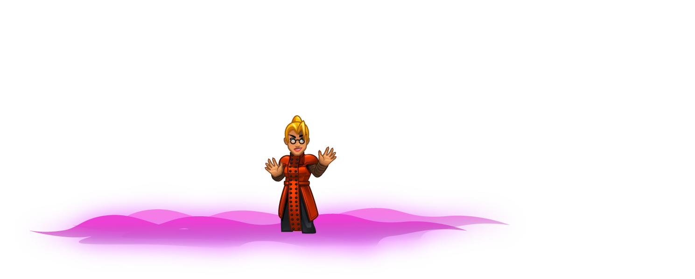

## _Magic Exam_

#### _Legend says:_
> Challenge: show your magical knowledge using all the programming skills you've learned so far!

#### _Goals:_
+ _Get 6 gold_
+ _Bonus: Get 12 gold_
+ _Bonus: Get 18 gold_
+ _Bonus: Get 24 gold_

#### _Topics:_
+ **Basic Syntax**

#### _Items we've got (- or need):_
+ Weapon

#### _Solutions:_
+ **[JavaScript](magicExam.js)**
+ **[Python](magic_exam.py)**

#### _Rewards:_
+ 88-242 xp
+ 52-142 gems

#### _Victory words:_
+ _I KNOW SOME MAGIC. SO THAT'S HOW IT WORKS! GIVE ME MORE SPELL TOMES!!! I'M THE MAGIC!_

___

### _HINTS_



It's time for another **special Challenge Level**!

Move to an X mark to open a door and see what's inside. Behind each door there will be a friend, an enemy, or an item. 

There are three friends and three enemies. Use various spells to help allies and harm enemies. Doors close after any spell usage, so one target - one spell.

There are three pairs of rooms (top and bottom) marked with the same color X. Each time you try, the ally and enemy in that pair of rooms can swap places.

In this level in addition to `findNearestEnemy` you have the method `findNearestFriend` which works the same but finds the nearest ally.

```javascript
var friend = hero.findNearestFriend();
if (friend) {
    hero.cast("heal", friend);
}
```

Read the Hints to learn more about the spells you can cast.

Solve this puzzle by **creatively** using all of the coding skills you’ve learned so far.

There is more than one way to complete this level; try to find a solution that will be estimated the best by the Master!

+ Bronze: 3
+ Silver: 12
+ Gold: 21

___

On this level you can use 6 spells. There is no cooldown in the Magic Academy, so you can use spells at any time. However, there's no benefit to casting a spell on the same target twice.

The spells you can cast are:

+ `heal` - Immediately heal the target for 300hp.
+ `regen` - Give the target regeneration, which restores health over time.
+ `poison-cloud` - An AOE spell which poisons all enemies within 10m of the target.
+ `shrink` - Reduce the size, mass, and health of the target.
+ `force-bolt` - A powerful magic bolt which can defeat strong ogres in one shot.
+ `grow` - Increase the size, mass, and health of the target.

___

The last two rooms contain potion bottles. One of them is `"poison"`, so you need to know how to distiguish them.

First, you need to use the `findNearestitem` method to find an item.

```javascript
var item = hero.findNearestitem();
```

Then check its `type`. Each unit or item has `type` property which is a `string`.

The health potion has `"potion"` type and the poison potion is type `"poison"`:

```javascript
if (item.type == "potion") {
    // ...
}
```

To take an item you need just to step on it:

```javascript
hero.moveXY(item.pos.x, item.pos.y);
```

As you will see, all rooms are paired and for each pair there is the a pair of spells which work best. Think about how spells can be connected by pairs.

Also, the Master likes brave students who are ready to experiment.

Maybe it's possible to collect the poison without dying?

___
