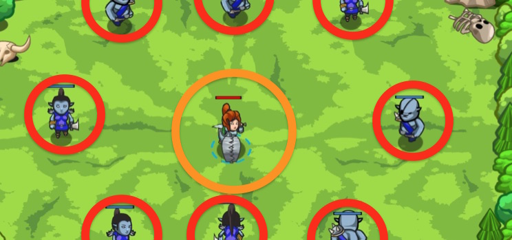

## _Hit and Freeze_

#### _Legend says:_
> The trapped predator still is a dangerous predator.

#### _Goals:_
+ _Defeat 5 or more ogres_

#### _Topics:_
+ **Variables**
+ **While Loops**
+ **Functions**
+ **If Statement**
+ **If/Else Statement**
+ **Return Statement**

#### _Items we've got (- or need):_
+ Weapon

#### _Solutions:_
+ **[JavaScript](hitAndFreeze.js)**
+ **[Python](hit_and_freeze.py)**

#### _Rewards:_
+ 89 xp
+ 49 gems

#### _Victory words:_
+ _DON'T MOVE A MUSCLE! OTHER THAN YOUR ATTACKING ARM._

___

### _HINTS_



You're caught in a trap! Wait until the ogres are close, then attack, or you'll injure yourself!

Functions can return a value, including a **boolean** value (true or false).

Use this to decide if an ogre is `inAttackRange()`:

```javascript
function inAttackRange(enemy) {
    var distance = hero.distanceTo(enemy);
    if(distance <= 3) {
        // return true because the enemy is in range
    } else {
        // return false because the enemy is out of range
    }
}
```

Save the result to a variable to use it later in the code:

```javascript
var canAttack = inAttackRange(target);
```

You can have several `return` statements in a function, but only one will be used, because `return` causes the function to stop executing, adn **returns** back to where the function was called.

```javascript
function moreThanTen(n) {
    // If `n` greater than 10, then the function will return true.
    if (n > 10) {
        return true;
    }
    // Otherwise 'return' inside 'else' will be called and the function will return false.
    else {
        return false;
    }
}

var isSmall = moreThanTen(5);  // isSmall === true
```

___
