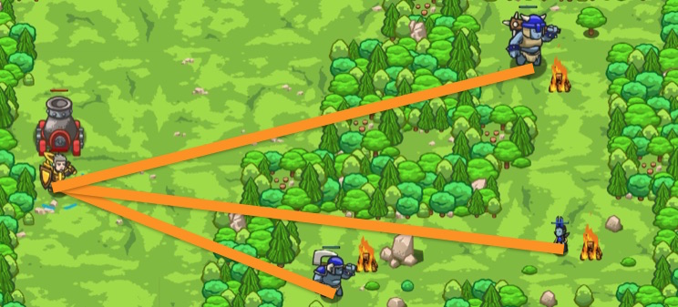

## _Backwoods Bombardier_

#### _Legend says:_
> Perfect your artillery skills with the power of positions.

#### _Goals:_
+ _Explode the ogres_

#### _Topics:_
+ **Strings**
+ **Variables**
+ **While Loops**
+ **If Statement**
+ **If/Else Statement**
+ **Accessing Properties**

#### _Items we've got (- or need):_
+ None

#### _Solutions:_
+ **[JavaScript](bombardier.js)**
+ **[Python](bombardier.py)**

#### _Rewards:_
+ 73 xp
+ 42 gems

#### _Victory words:_
+ _NICE USE OF PINPOINT PRECISION PROPERTIES!_

___

### _HINTS_



The hero can read the exact position of enemies by looking at their `.pos` attribute.

Enemies (and heroes!) have a `pos` property that represents their position.

The `pos` property itself has two properties: `x` and `y`, which are floating-point (decimal) numbers:

```javascript
var pos = enemy.pos;
var x = pos.x;
var y = pos.y;
hero.say(x + "," + y)
```
The X represents the **horizontal** position of the enemy.

The Y represents the **vertical** position of the enemy.

___
