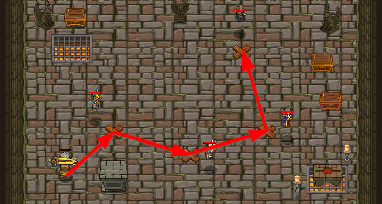

## _The Wizard's Haunt_

#### _Legend says:_
> Explore the wizards' hideout in search of more secrets.

#### _Goals:_
+ _Discover the gate to the astral plane_

#### _Topics:_
+ **Basic Syntax**
+ **Arguments**
+ **Variables**
+ **Arithmetics**

#### _Items we've got (- or need):_
+ None

#### _Solutions:_
+ **[JavaScript](wizHaunt.js)**
+ **[Python](wiz_haunt.py "Top-5 - 12.13s")**

#### _Rewards:_
+ 60 xp
+ 71 gems

#### _Victory words:_
+ _THAT PORTAL DOESN'T LOOK TOO SAFE..._

___

### _HINTS_



You've gained entry to the wizards' hidden hideout! But you've heard rumors of a gateway to a secret chamber in a parallel dimension, containing untold treasure. Maybe you can talk your way into it.

Listen carefully to what each wizard says to figure out how to calculate each magic number. You'll need to take things one wizard at a time.

Look at the Hints to learn how to write out math formulas in code.

___

The division operator `/` is used to divide one number by the other.

Use a variable to store this result.

```javascript
var bea = min / 5;
```

Be sure to move in front of the next wizard:

```javascript
hero.moveXY(42, 20);
```

Say the answer to the wizard:

```javascript
hero.say(bea);
```

Complete the last lap of the wizard's challenge by subtracting the two variables and saying it infront of the correct wizard.

In this level, you walk around to each wizard, following their instructions to calculate the magic numbers you need to speak. You'll have to edit and run your program multiple times to get all the instructions; take it one step at a time and you'll work your way through it.

You remember the syntax for add, subtrct, multiply, and modulo from **The Wizards Door**:

```javascript
var a = 4 + 5;   // a == 9
var b = 7 - 3;   // b == 4
var c = 2 * 6;   // c == 12
var d = 8 % 3;   // d == 2
```

To divide, you just use the slash ('/') symbol:

```javascript
var a = 6 / 2;  // a == 3
```

But what do you get when the numbers don't divide evenly?

```javascript
var a = 6 / 5;  // a == 1.2
```

Don't forget to use variables to hold the wizards' magic numbers as you go through the level. You'll need to keep track of them to complete this level!

___
