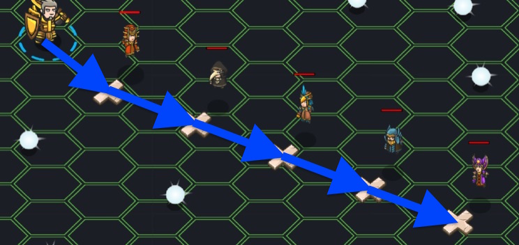

## _The Wizard's Plane_

#### _Legend says:_
> Travel to the astral plane and face the harshest of numeromancers.

#### _Goals:_
+ _Find the hidden gold_

#### _Topics:_
+ **Basic Syntax**
+ **Arguments**
+ **Variables**
+ **Arithmetics**

#### _Items we've got (- or need):_
+ None

#### _Solutions:_
+ **[JavaScript](wizPlane.js)**
+ **[Python](wiz_plane.py "Top-10 - 13.93s")**

#### _Rewards:_
+ 60 xp
+ 71 gems

#### _Victory words:_
+ _GOLD, GOLD EVERYWHERE! THE RICHES ARE YOURS!_

___

### _HINTS_



You have talked your way into a mysterious alternate plane of reality. Only the cleverest of wizards dwell here, but you're determined to find their secret treasures.

These crafty wizards weave complex spells, and will accept no mistakes from intruding adventurers. Use parentheses to make sure your formulae are in the correct order!

Listen carefully to what each wizard says to figure out how to calculate each magic number. You'll need to take things one wizard at a time.

___

For the final challenge, use the `(` and `)` paranthesis operators to help with order of operations.

Use a variable to store Zsofi's password:

```javascript
var zso = (tam - 1) * 4;
```

Be sure to move in front of 'Zsofi' before saying the password.

```javascript
hero.moveXY(32, 24);
```

Say the password to advance.

```javascript
hero.say(zso);
```

Complete the challenges for the next two wizards.

Be sure to use `(`, `)`, `*` and `/` to properly calculate their passwords.

In this level, you walk to each wizard, following their instructions to calculate the magic numbers you need to speak. You'll have to edit and run your program multiple times to get all the instructions; take it one step at a time and you'll work your way through it.

You've learned how to write all kinds of arithmetic in code:

```javascript
var a = 7 - 3;  // a == 4
var b = 2 * 6;  // b == 12
var c = 6 / 5;  // c == 1.2
```

In this level, you'll be combining these operations to do complex calculations. Make sure you use parentheses to ensure that things happen in the right order! Remember that multiplication and division come before addition and subtraction:

```javascript
var a = 2 + 3 * 4;  // a == 14
var b = (2 + 3) * 4;  // b == 20
```

Don't forget to use variables to hold the wizards' magic numbers as you go through the level. You'll need to keep track of them to complete this level!

___
