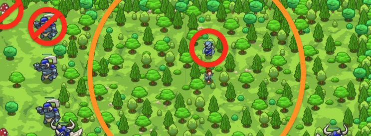

## _Forest Shadow_

#### _Legend says:_
> Lower than grass. Quieter than leaves.

#### _Goals:_
+ _Defeat ogres in the forest_
+ _Collect 2 gems_
+ _Collect 2 coins_

#### _Topics:_
+ **Strings**
+ **Variables**
+ **While Loops**
+ **If Statements**
+ **Accessing Properties**
+ **Boolean OR**

#### _Items we've got (- or need):_
+ Weapon

#### _Solutions:_
+ **[JavaScript](forestShadow.js)**
+ **[Python](forest_shadow.py)**

#### _Rewards:_
+ 69 xp
+ 79 gems

#### _Victory words:_
+ _FOREST LURKIN'_

___

### _HINTS_



This grove is a nice place for an ambush. The big ogres can't see you through all the trees, so hunt for ogre `"thrower"`s or `"munchkin"`s only.

Also, it's a good opportunity to collect shiny items - `"gem"`s or `"coin"`s.

Don't drink or eat anything!

Remember you can use an **OR** statement to find different kinds of enemies or items:

```javascript
if (enemy.type == "munchkin" || enemy.type == "thrower") {
    hero.attack(enemy);
}
```

___
