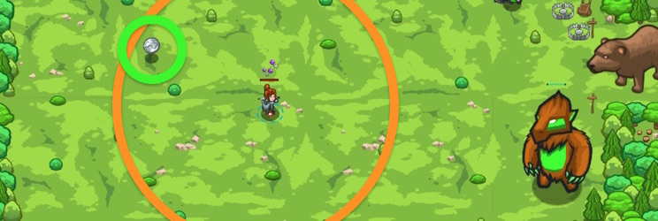

## _Coin Hunter_

#### _Legend says:_
> To catch your prey, be patient. Don't move until you're sure that you can catch it.

#### _Goals:_
+ _Collect 5 coins_

#### _Topics:_
+ **Variables**
+ **While Loops**
+ **If Statements**
+ **Nested If Statements**
+ **Accessing Properties**
+ **Return Statements**

#### _Items we've got (- or need):_
+ Longrange glasses

#### _Solutions:_
+ **[JavaScript](coinHunher.js)**
+ **[Python](coin_hunter.py)**

#### _Rewards:_
+ 89 xp
+ 49 gems

#### _Victory words:_
+ _ANOTHER DAY, ANOTHER DOLLAR WORTH OF GOLD COINS!_

___

### _HINTS_



The famous hunter Senick agreed to train you! Coins appear and disappear after a short time. Only move to coins that are closer than **20 metres**.

Write a function to decide if you should run for a coin:

```javascript
// coin is passed in as a parameter
function isCoinClose(coin) {
    // Return true if the coin is close
    // Else return false
}
```

You need to write a function which receives a parameter `coin` (an item), finds the distance from the hero to that coin and decides if it close enough.

To get the distance to a coin use:

```javascript
var distance = hero.distanceTo(coin);
```

To decide if it's close enough (distance less than 20 metres) use:

```javascript
if (distance < 20) {
    // ...
}
```

___
