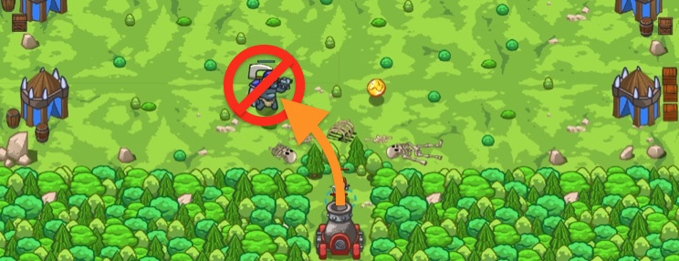

## _Metal Detector_

#### _Legend says:_
> If gold will not come to ogres, ogres will go to gold.

#### _Goals:_
+ _Lure ogres to their doom_

#### _Topics:_
+ **Variables**
+ **While Loops**
+ **If Statements**
+ **If/Else Statements**
+ **Functions**
+ **Return Statements**

#### _Items we've got (- or need):_
+ Longrange glasses

#### _Solutions:_
+ **[JavaScript](metalDetector.js)**
+ **[Python](metal_detector.py)**

#### _Rewards:_
+ 89 xp
+ 49 gems

#### _Victory words:_
+ _BEEP, BEEP, BEEP, YOU FOUND: A VICTORY!_

___

### _HINTS_

That ogre camp is well guarded, but we can reduce the ogre numbers. We hid the artillery in the forest and prepared gold coins. Our plan is simple: a coin appears, an ogre runs for the coin, we shoot at the coin, done.

You task is to work as a rangefinder. Wait for a coin and then `say` the `distanceTo()` the coin.

You've learned about functions with `return` in the previous levels. Now it's the time to prove your knowledge! Complete the function and don't forget `return` in it.

To get the distance to an item use glasses method `hero.distanceTo(item)`. You function should return `0` (zero) if there isn't a coin.

___
