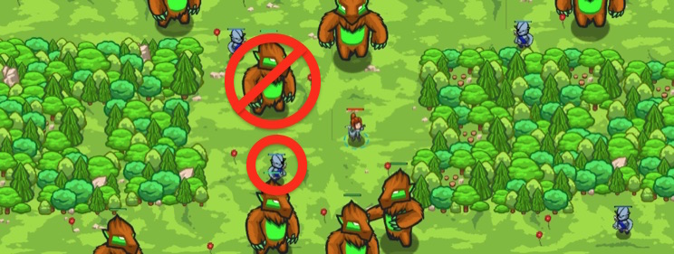

## _Burlbole Grove_

#### _Legend says:_
> To attack, or not attack? That is the question.

#### _Goals:_
+ _Don't attack any burls_
+ _Defeat the ogres_

#### _Topics:_
+ **Strings**
+ **Variables**
+ **While Loops**
+ **If Statements**
+ **Return Statements**
+ **Accessing Properties**

#### _Items we've got (- or need):_
+ Weapon

#### _Solutions:_
+ **[JavaScript](burboleGrove.js)**
+ **[Python](burbole_grove.py)**

#### _Rewards:_
+ 89 xp
+ 49 gems

#### _Victory words:_
+ _WHERE DARK WOODS HIDE SECRETS, I WILL HEAR THEIR EVERY STORY._

___

### _HINTS_



Functions can `return` a value!

When a function is called, it will be equal to whatever value it **returns**.

```javascript
function plusTwo(x) {
    return x + 2;
}

var number = plusTwo(5);
// number is now 7
```

___

Functions can `return` values, which make it useful to do calculations or manage `if`-statements.

Remember that `if`-statements only perform the actions in their code blocks if their condition is `true`.

First check if there is no target using the `not` opereator `!`:

```javascript
if (!target) {
    // ...
}
```

Returning `false` will make the hero not attack anything. Because there are `not` any enemies, this is correct.

```javascript
return false;
```

Remember, `if not target, return false`:

```javascript
if (!target) {
    return false;
}
```

Next check if a target's `type` is `"burl"`, because we don't want to attack those giant beasts!

```javascript
if (target.type == "burl") {
    // ...
}
```

Again you want to `return false` if the target is a deadly `"burl"`.

___

Functions can `return` a value!

When a function is called, it will be equal to whatever value it **returns**.

```javascript
function plusTwo(x) {
    return x + 2;
}

var number = plusTwo(5);
// number is now 7
```

In this level, your function `shouldAttack(target)` needs to return true if there is a valid target to attack, or false if not.

Then, your code can use `shouldAttack` to decide if your hero should attack!

```javascript
function shouldAttack(target) {
    // return false if there is no target
    if (!target) {
        return false;
    }

    // Also return false if target.type == "burl"

    // Otherwise, return true
    return true;
}
```

_**Note**:_ When a function executes a `return` statement, that function immediately ends!

```javascript
function foo() {
    return "foo";
    hero.say("bar");  // This will never happend!
}
```

___
