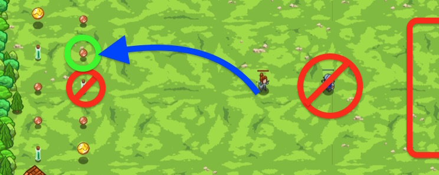

## _Useful Competitors_

#### _Legend says:_
> The battlefield is littered with coins and poison. Use peons to filter the poison and gather the coins!

#### _Goals:_
+ _Defeat the ogres_
+ _Grab all the coins_

#### _Topics:_
+ **Strings**
+ **Variables**
+ **While Loops**
+ **If Statements**
+ **Nested If Statements**
+ **Accessing Properties**

#### _Items we've got (- or need):_
+ Weapon

#### _Solutions:_
+ **[JavaScript](useful.js)**
+ **[Python](useful.py)**

#### _Rewards:_
+ 69 xp
+ 79 gems

#### _Victory words:_
+ _THAT'S ONE USE FOR YOUR ENEMIES..._

___

### _HINTS_



Check an item's `type` to make sure the hero doesn't pick up `"poison"`.

Use an `if`-statement and `not` to find items that are not type `"poison"`:

```javascript
if (item.type != "poison") {
    // ...
}
```

Now that we know the item's type is `not "poison"`, we can pick them up by using `mouseXY` to their position.

In this level you'll need to use the `not` operator to filter your enemies and items!

`not` takes the logical inverse of a value and returns it:

```javascript
// not in JavaScript is written as "!"
hero.say(!false);  // The hero says "true"
hero.say(!true);  // The hero says "false"
```

To use in a conditional statement:

```javascript
if (!hero.isReady('cleave')) {
    // Do something while cleave is on cooldown!
} else {
    // Cleave is ready.
}
```

___
