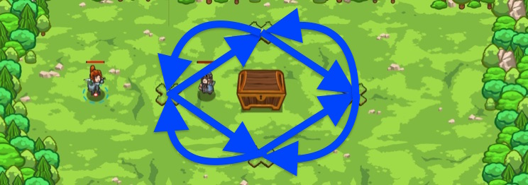

## _Logical Circle_

#### _Legend says:_
> Follow Lukacs deeper into the woods with more complex logic.

#### _Goals:_
+ _Open the treasure chest_

#### _Topics:_
+ **Basic Syntax**
+ **Variables**
+ **If Statements**
+ **If/Else Statements**
+ **Boolean AND**
+ **Boolean OR**

#### _Items we've got (- or need):_
+ None

#### _Solutions:_
+ **[JavaScript](logicCircle.js)**
+ **[Python](logic_circle.py "Top-10 - 6.27s")**

#### _Rewards:_
+ 69 xp
+ 79 gems

#### _Victory words:_
+ _WHAT'S WITH WIZARDS AND PORTALS?_

___

### _HINTS_



Lukacs has led you to another grove with even more treasure to be had! He just needs you to answer a few more of his riddles...

String together chains of boolean values with ANDs and ORs to do more complex logic.

___

Operations can be chained. Use a variable to store the result of the chained `||` operators:

```javascript
var secretD = secretA || secretB || secretC;
```

Use an `if/else` to check if the secret is `true` or `false`:

```javascript
if (secret) {
    // ...
} else {
    // ...
}
```

If the secret is `true`, move accordingly:

```javascript
hero.moveXY(30, 33);
```

Else the secret is `false`, so move the other direction:

```javascript
hero.moveXY(40, 24);
```

Repeat the chaining across each of the known secrets! Use the `&&` operator 4 times.

Like in **Logical Path** you will use _boolean logic_ to decide which path to take, but this time, you'll be walking around a large chest full of treasure.

First, you'll take either the high or low path depending on whether the secret value is TRUE or FALSE. Then from there, you'll go either left or right. Then high or low again, and so on and so forth.

_Boolean operators_ like AND and OR can work on more than two values at a time. AND is TRUE if _all_ of its values are TRUE:

```javascript
var a = true && true && true;  // a == true
var b = true && false && true;  // b == false
var c = false && true && false;  // c == false
var d = false && false && false;  // d == false
var e = true && true && true && true && false && true;  // e == false
```

OR is TRUE if _any_ of its values are TRUE:

```javascript
var a = true || true || true;  // a == true
var b = true || false || true;  // b == true
var c = false || true || false;  // c == true
var d = false || false || false;  // d == false
var e = false || false || false || false || true || false;  // e == true
```

Use variables to track of which values are being asked for, and just chain them together to get to Lukacs's treasure!

___
