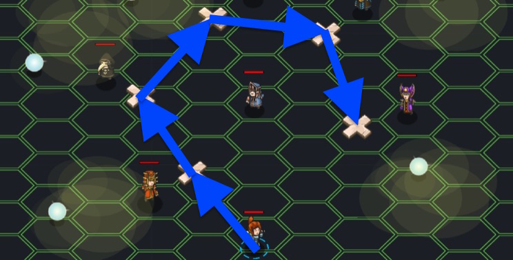

## _Logical Conclusion_

#### _Legend says:_
> Journey to the astral plane and rescue Lukacs from the wizard conclave.

#### _Goals:_
+ _Rescue Lukacs_

#### _Topics:_
+ **Basic Syntax**
+ **Arguments**
+ **Variables**
+ **Boolean AND**
+ **Boolean OR**

#### _Items we've got (- or need):_
+ None

#### _Solutions:_
+ **[JavaScript](logicConc.js)**
+ **[Python](logic_conc.py "#1 - 14.07s")**

#### _Rewards:_
+ 69 xp
+ 79 gems

#### _Victory words:_
+ _BOOK IT!_

___

### _HINTS_



The gold that Lukacs has given you wasn't his to share! The wizards of the astral plane are none too pleased, and have summoned him to answer for his crimes. It will take your sharpest thinking to answer the wizards' riddles and convince them to free Lukacs and let you return to the forest!

Go to Eszter and get the three secret TRUE/FALSE values you need to start the challenge. Then run the gauntlet of wizards and figure out each one's secret TRUE/FALSE value. Use parentheses to make sure everything is computed in the correct order!

___

In this level you will use advanced boolean logic to decide what to say to each wizard. Like in **Logical Circle** you'll begin with three secret values, and you'll combine them in different ways to solve each puzzle. But in this level, you will need to mix AND, OR, and NOT statements in the correct ways to come up with the correct answers.

When mixing boolean operators, NOT takes precedence over AND, which takes precedence over OR:

```javascript
var a = true && false || true;
//    =     false     || true
//    =              true

var b = true || false && true;
//    = true ||     false
//    =     true

var c = true || !true && true;
//    = true || false && true
//    = true ||     false
//    =     true
```

That's way too hard to read, though! Just use parentheses to make it clear which operators go first:

```javascript
var a = (true && false) || true;
//    =     false       || true
//    =                true

var b = true || (false && true);
//    = true ||      false
//    =     true

var c = true || ((!true) && true);
//    = true ||   false  && true
//    = true ||        false
//    =     true
```

Using parentheses also allows us to change the order that operators work in:

```javascript
var a = !true || true && false;
//    = false || true && false
//    = false ||    false
//    =     false

var b = !((true || true) && false);
//    = !(     true      && false)
//    = !              false
//    = true
```

___
